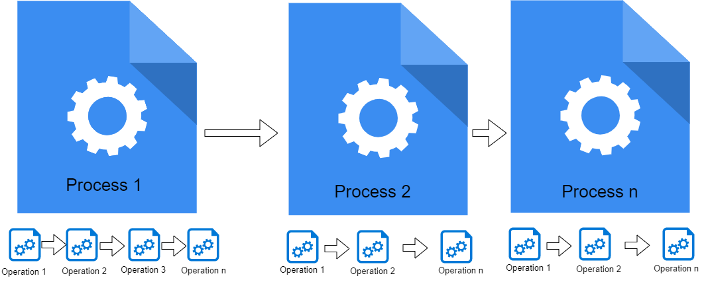
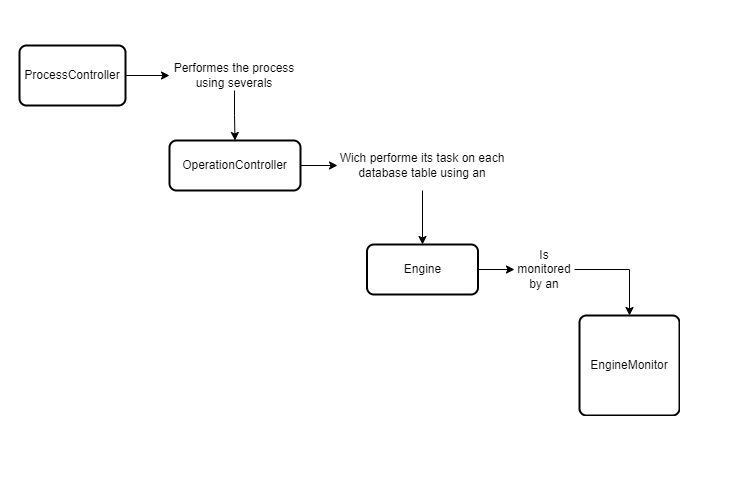

# Introduction
The epts-etl module is an OpenMRS module designed to perform generic ETL operations and much more. The epts-etl module can be integrated with an OpenMRS instance, but it can also run as a stand-alone Java application. Please note that this module is still in development, and some of its features may not function correctly at this time.
# Architecture overview
The epts-etl module is written in Java and follows the OpenMRS module pattern. Its core functionality is implemented at the API level, allowing it to operate as a stand-alone application. At the top of the EPTS-ETL logic are Processes, which represent a set of operations intended to function as tasks that collectively achieve a specific objective.

 

From the code perspective an process is handled by the [ProcessController](api/src/main/java/org/openmrs/module/epts/etl/controller/ProcessController.java) class and the tasks or operations are handled by [OperationController](api/src/main/java/org/openmrs/module/epts/etl/controller/OperationController.java) class. 
 
The process and its operations are configured via JSON file on which all the necessary information for a process to be run are specified. The configuration file will determine which kind of process must be performed.
 
The process configuration is mapped to [EtlConfiguration](api/src/main/java/org/openmrs/module/epts/etl/conf/EtlConfiguration.java) class and each operation are mapped to [EtlOperationConfig](api/src/main/java/org/openmrs/module/epts/etl/conf/EtlOperationConfig.java).
Each operation defined in the process configuration file will perform the very same task on all items listed on the configuration file. The etl item configuration is mapped to [EtlItemConfiguration](api/src/main/java/org/openmrs/module/epts/etl/conf/EtlItemConfiguration.java) which defines the rules of ETL.
 
An [Operation Controller](api/src/main/java/org/openmrs/module/epts/etl/controller/OperationController.java) performs its task using an [Task Processor](api/src/main/java/org/openmrs/module/epts/etl/engine/TaskProcessor.java). The processors are monitored by [Engine](api/src/main/java/org/openmrs/module/epts/etl/engine/Engine.java) class. The interaction between the core classes is illustrated on the image below.



## The Process Configuration File
The process configuration file is the heart of the application. For each process type there is a specific configuration setup which must be done. A configuration file is a JSON file which in almost all cases has 4 sections as shown below.

 
 
- **The section 1** contains the general configurations usually applied to all the operations and involved etl items.
- **The section 2** defines the database connection info for source database and/or destination database.
- **The section 3** defines the operations configuration parameters.
- **The section 4** lists the ETL configuration. This define the rules of how the extraction, transformation and load will be hundled.

## The common configuration
- *processType*: A string representing the Process Type. The supported types are listed in the section "Supported Process Types."
- *etlRootDirectory*: a full path to the directory where the process files will be placed.
- *childConfigFilePath*: a full path to another JSON configuration file which defines a process that will be executed when the current process is finished. This parameter allows multiple processes to be executed in sequence. This can be useful, for example, when there is a need to merge multiple databases.
- *originAppLocationCode*: a token representing the location where the process is running. In the case of the merge process, this will be the source location.
- *manualStart*: an optional boolean indicating whether the process related to this configuration file will be manualy started. If true, the process will not start at application startup.
- *params*: a map object that enables the configuration of parameters. These parameters are usually used in queries defined in the ETL item configuration.
- *disabled*: indicates whether the process is disabled.
- *syncStageSchema*: an optional token indicating the database name where the process data will be stored. If not present, the name "etl_stage_area" will be used.
- *doNotTransformsPrimaryKeys*: indicates whether the primary keys in this process are transformed. If yes, the transformed records are given a new primary key; if no, the primary key in the source is the same in the destination.
- *manualMapPrimaryKeyOnField*: if present, the value from this field will be mapped as a primary key for all tables that don't have a primary key but have a field with a name matching this field. This value will be overridden by the corresponding value in the ETL configuration session if present there.
- *doNotResolveRelationship*: if true, the relationship between tables will not resolved on destination database. This usualy is applyed in situation like database copy were the table keys will not kept unchanged. 

## The Database configuration
This section allowd the database configuration. The "srcConnConf" allows the configuration of source database and the "dstConnConf" allows the configuration of destination database. Each element allow bellows parameters: 
- "dataBaseUserName" which represent the database username;
- "dataBaseUserPassword" which represents the database password;
- "connectionURI" the connection url to the dabase;
- "driveClassName" the jdbc drive class name for database connection;
- "schema" an optional field to specify the database schema if it cannot be determined from the connection url or if it is diffent from this one.
- "databaseSchemaPath": an optional field which indicate the path where the database schema is located. If present, and the specified database is not present on the specified database, the database will be created according to this script;
- Other configuration for database from jdbc.poll.Datasource: *maxActiveConnections*, *maxIdleConnections*, *minIdleConnections*

## The Operation configuration
This section allow the configuration of operations. Each operation can be defined by the following fields:
- "operationType": indicates the operation to be executed for each item defined on ETL configuration session;
- "processingBatch": the amount of records to be processed in a batch, if not present, a default batch of 1000 will be applied;
- "threadingMode": indicates if the processing should be done using a SINGLE or MULTI threads. Possible values: MULTI, SINGLE, default is MULTI;
- "fisicalCpuMultiplier": when using MULTI threading, the amount of available physical CPU will be multiplied by the value from this propertie. This allow to overpower the processing. Notice that using big values for this can lead to process slowdown; 
- "processingMode": indicate the way the ETL items will be processed. (1) SERIAL: indicates that one ETL Item will be processed at time (2) PARALLEL: all the listed ETL Item will be processed at same time; if not present, a SERIAL mode will be applied;
- "processorFullClassName": a full class name indicating a customized processor.
- "skipFinalDataVerification": the final verification is done to check if all the records on the source were processed to the destination database. If this field is set to false, the final check will be skipped! Since the final verification could take time, disabling it could improve the speed; 
- "doNotWriteOperationHistory": by default the information of each processed record is stored on the Etl Staging table. This information is important as can help to know the source and destination of an record processed on the ETL process. If this field is set to true, the history will not be stored and this could improve the speed of process.
- "useSharedConnectionPerThread": If the processing is done by multiple threads, setting this field to true means all threads will share the same database connection. This can help reduce deadlocks but may negatively impact performance. This configuration is also useful when we need to ensure that the records in a batch are available in the target database simultaneously.
- "actionType": represent the action on the ETL process. The supported action are: (1) CREATE: This action creates new dstRecord on ETL operation (2) DELETE:  This action deletes the dstRecord on ETL operation (3) UPDATE: This action update the dstRecord on ETL operation. If not present, a CREATE action will be applied.
- "afterEtlActionType": defines the action which will be perfomed on the src record after the operation. Only the action "DELETE" will have effect;
- "dstType": indicates the destination type which can be: (1) **db**: the transformed record will be stored on the database (2) **json**: the transformed record will be written on json file (3) **dump**: the transformed record will be written os sql file as an sql query (4) **csv**: the transformed record will be written on csv file. When the dstType is a file, then the file will be stored under @etlRootDirectory/data/@originAppLocationCode (5) **console** the tranformed records will be written on the console
- "disabled": if true , the this operation will not be run;
- "child": a nested operation configuration which will be executed after the main operation is finished;
- "finishOnNoRemainRecordsToProcess": When a process starts, it determines the *minimum* and *maximum* records in intervals to be processed and calculates the *number of records to handle* within each interval. The process will analyze the entire range between the minimum and maximum records and will only complete once the maximum record is reached. However, if *finishOnNoRemainRecordsToProcess* is set to true, the process will finish as soon as the calculated number of records to process is reached, even if the maximum record has not been reached.
- "totalCountStrategy": Define the strategy for calculating the total number of records to be processed. When the application processes the ETL item for the first time, it calculates the total record count, which is useful for progress tracking. By default, this property is set to 'COUNT_ONCE,' meaning the application will calculate the total record count during the initial processing. If the process is interrupted and restarted, the count will not be recalculated. Depending on the complexity of the ETL process, this calculation can be time-consuming, and you may want to disable it. In such cases, you can use 'USE_MAX_RECORD_ID_AS_COUNT,' which uses the maximum record ID from the source table's record range as the total count.     
	

## The etl item configuration
The etl item configuration section defines the rules of extraction, transformation and load. Each operation in a process will perform its task on these items. Below are listed the properties which can appear in an item configuration. Each item can contain two objects representing the data source configuration and destination configuration.

```
{
   "srcConf":{
	  "tableName":"",
	  "extraConditionForExtract":"",
	  "observationDateFields":[
		 
	  ],
	  "sharePkWith":"",
	  "metadata":"",
	  "removeForbidden":"",
	  "uniqueKeys":[
		 
	  ],
	  "parents":[
		 
	  ],
	  "extraTableDataSource":[
		 
	  ],
	  "extraQueryDataSource":[
		 
	  ]
   },
   "dstConf":[
	  
   ],
   "createDstTableIfNotExists": "",
   "etlItemSrcConf":{
	  
   },
   "disabled":""
}
```

The srcConf define the configuration of the source of etl process for an item and the dstConf list the data destination table in the Etl process. This configuration can be omited if there is no transformation in the process and the destination table field can automatically mapped from the data source. If "createDstTableIfNotExists" field is set to true, the dst table will be automaticaly created in the dst database if it does not exists. The "disabled" field allow the item to bem ignored on the etl process.  

Bellow are explained the relevant configuration for "srcConf" and "dstConf".

### The "srcConf"
The "srcConf '' allows the configuration of datasource in an etl process. The relevant configuration fields are explained below
- *tableName*: table name of the main data source.
- *parents*: list of configured parents. Note that if there is no additional configuration for the parent, there is no need to include this property as it will automatically loaded using the information schema;
- *metadata*: optional boolean indicating that the table is a metadata table;
- *removeForbidden*: optional boolean that indicate if records from this table can be automatically removed when there is inconsistencies
- *observationDateFields*: optional list of date fields which will be checked when an operation need to look for records which had some action in certain period (ex. records created or updated within a period)
- *extraConditionForExtract*: optional param which contains the extra sql condition to be injected when the operation queries for records to process.
- *uniqueKeys*: optional list containing the unique key info. This is unnecessary if the table has explicit unique keys;
- *auxExtractTable*: optional list containing the joining tables which helps to add additional extraction conditions; this act as a extra data source also;
- *extraTableDataSource*: optional list of auxiliary tables to be used as data source
- *extraQueryDataSource*: option list of auxiliary queries to be used as data source;
- *extraObjectDataSource*: option list of auxiliary objects configuration to be used as data source;
  
Bellow are additional explanation of complex configuration on "srcConf"

#### Unique Keys
The *"uniqueKeys"* allow the configuration of src table unique keys. If the table defines the unique keys in its metadata then there is no need to manually configure the unique keys. But when needed, the unique keys can be configured following below pattern.

``` {
   "srcConf":{
      "uniqueKeys":[
         {
            "fields":[
               {
                  "name":""
               }
            ]
         }
      ]
   }
}
```

#### Parents configuration
A parent is configured as an object and can have additional properties. Note that when there are no additional properties you can omit the parent on the list of parents. When you want to manually add parent on the etl item configuration it should have the appearance bellow:
```
{
   "srcConf":{
      "parents":[
         {
            "tableName":"",
            "mapping":[
               {
                  "childFieldName":"",
                  "parentFieldName":"",
                  "defaultValueDueInconsistency":"",
                  "setNullDueInconsistency":"",
                  "ignorable":""
               }
            ],
            "conditionalFields":[
               {
                  "name":"",
                  "value":""
               }
            ],
            "defaultValueDueInconsistency":"",
            "setNullDueInconsistency":""
         }
      ]
   }
}
```

For each parent, we can define the **mapping**, which allows us to specify the child and parent fields. Within the "mapping," we can also define the following fields: *defaultValueDueInconsistency*, *setNullDueInconsistency*, and *ignorable*.

If present, the value in the "defaultValueDueInconsistency" field will replace the original value in the child if the original value does not represent an existing parent. The "setNullDueInconsistency" field is a boolean value. If set to true, the original parent value will be replaced by null if it is inconsistent. The "ignorable" field indicates whether this relationship can be ignored.

Within the parent configuration we can also define the "conditionalFields". The conditional fields determine the condition when a specific relationship will be applied. This means that this relationship is not applied for all the records in the child table. An example can be found in openmrs data model. E.g the table person_attribute which has the fields "person_attribute_type_id" and "value". For the specific "person_attribute_type_id" the "value" could reference a specific record in other tables, ex: when the type is 7, then the "value" refies to a location which is detailed in table "location". In this case, we can map the relationship between the table "person_attribute" and "location" as a conditional relationship where the conditional field name is "person_attribute_type_id" and the conditional value is "7".

We can also define a global "defaultValueDueInconsistency" and "setNullDueInconsistency" in a relationship between the table and its parents. These are global properties within the relatishioship meaning that for all the mapping these values will be applied.   

#### The auxExtractTable table configuration
<a name="aux-extract-table"></a>

The **"auxExtractTable"** element, allow the specification of extra tables to be used as joining tables to the main table. This allow the inclusion of additional querying condition from those joining tables. This is also used as an additional data source for the etl item configuration.     

```
{
   "srcConf":{
      "auxExtractTable":[
         {
            "tableName":"",
            "joinExtraCondition":"",
            "joinFields":[
               {
                  "srcField":"",
                  "dstField":""
               }
            ],
            "joinType":"",
	    "doNotUseAsDatasource": "",	
            "auxExtractTable":[
               
            ]
         }
      ]
   }
}
```	 

As can be seen on the code above, each auxExtractTable can have the **tableName** which represents the name of table to be joined; **joinExtraCondition** which define an extra sql condition for joining; **joinFields** which are optional joining fields which must only be specified if the data model does not define the joining fields between the main table and the joining table, there is also **joiningType** which can be INNER, LEFT or RIGHT; the "doNotUseAsDatasource" allows the exclusion of the "auxExtractTable" from the data sources; by default, an "auxExtractTable" is also a datasource.  

**NOTE** that you can add inner "auxExtractTable" within the main "auxExtractTable" which is also a list of auxiliary tables which allow you to add more conditions for extraction.


#### The extra datasource table configuration

The **"extraTableDataSource"** element, allows the specification of extra tables to be used as data source in addition to the main table. The relevant configuration info for extra table datasource is shown below    
```
{
   "srcConf":{
      "extraTableDataSource":[
         {
            "tableName":"",
            "joinExtraCondition":"", 
            "joinFields":[
               {
                  "srcField":"",
                  "dstField":""
               }
            ],
            "joinType":"",
            "auxExtractTable": [
	    ]
         }
      ]
   }
}
```

As can be seen on the code above, each extraTableDataSource can have the **tableName** which represents the name of extra datasource table; **joinExtraCondition** which define an extra sql condition for joining; **joinFields** which are optional joining fields which must only be specified if the data model does not define the joining fields between the main table and the joining table, Final there is **joiningType** which can be INNER, LEFT or RIGHT. The **auxExtractTable** allows the inclusion of additional tables which can be joined with the extraTableDataSource for the purpose of inclusion of extra conditions; this is also used as an extra datasource. (See [AuxExtractTable](#aux-extract-table)) 

#### The extraQueryDataSource configuration

The **"extraQueryDataSource"** element, allows the specification of extra queries to be used as data source in addition to the main table. There relevant configuration info for extra table datasource is shown below.    
```
{
   "srcConf":{
      "extraQueryDataSource":[
         {
            "name":"",
            "query":"", 
            "script":
            "required":""
         }
      ]
   }
}
```

As can be seen on the code above, each extraQueryDataSource can have the
- **name** which represents the name of extra datasource query;
- **query** which define the sql query;
- **script** which defines the relative path to the file containing the query. The application will look for the query files under @etlRootDirectory/dump-scripts/. Note that the application will try to load the "script" only if the "query" field is empty.
- **required** if true, the source record will be ignored if the query does not return an result;

#### The extraObjectDataSource configuration
An object datasource allows to include object fields as datasource. The values for those object fields can be directly configured within the object datasource or be generated using an user defined custom generator. This generator can be written on a supported programing language (notice that currently only java language is supported).

```
"extraObjectDataSource":[
   {
	  "name":"",
	  "objectFields":[
		 {
			"name":"",
			"value":"",
			"transformer":"",
			"dataType":""
		 }
	  ],
	  "objectLanguage": "",
	  "fieldsValuesGenerator":""
   }
]		 
```	
Each "extraObjectDataSource" is defined by
- *name* which is the unique datasource identifier within the etl item configuration;
- *objectFields* the list of object fields. Note that each field is defined by:
  - (1) **name** the unique field name within the datasource;
  - (2) **value** allow the specification of fixed value for the field. This value can be constant, parameter or expression. Parameter values should start with '@' then followed by an identifier. If no value is specified then application will assume that the "fieldsValuesGenerator" will generates the "value";
  - (3) **transformer** a transformer enables transformation of "value". A transformation is needed when the "value" is an expression. There are 3 types of transformers, namely: (1) the *org.openmrs.module.epts.etl.etl.processor.transformer.ArithmeticFieldTransformer* which allow the evaluation of arithmetic expressions (2) *org.openmrs.module.epts.etl.etl.processor.transformer.StringTranformer* which allow the transformation through string methods and (3) the *org.openmrs.module.epts.etl.etl.processor.transformer.SimpleValueTranformer* which allow the direct transformation of value. If empty, then the **SimpleValueTranformer** will be applied .  
  - (4) **dataType** an optional token to specify the data type for value. By default, the type will match the final expression type from the transformer. Supported types: int, long, double, string, date      
- *objectLanguage* specify the language to be used to process the field generation. This can be omitted if there is no custom generator to be used
- *fieldsValuesGenerator* a full class name for custom field generator.   

For demo see [exploring-objectdatasource-field-transformers](docs/demo/README.md#exploring-objectdatasource-field-transformers) session.

#### The use of params whithin Src Configuration
The Src configuration allows the use of params for querying. The params can be present on "joinExtraCondition", "extraConditionForExtract", "query", "tableName", etc. Parameters will be defined as identifiers preceded by "@". Eng. "location_id = @locationId". The parameters can appear in several context within queries, namely, (1) as a select field: "SELECT @param1 as value FROM tab1 WHERE att2=1"; (2) in a comparison clause: "SELECT * FROM WHERE att2 = @param2" (3) In "in" clause: "SELECT * FROM tab1 WHERE att1 in (@param2)" (4) as DB resource: "SELECT * FROM @table_name WHERE att1 = value1". (5) in "tableName" specification in any party configuration file, e.g {"tableName":"@mainSchema.@nameOfTable"}

The parameter value will be lookuped following below sequence:
(1) first on configured parameters on "params" propertie;
(2) in not present will be lookuped on properties of etl configurations file;
(3) and finally on the current main src objects.  

For demo see [the-power-of-parameters](docs/demo/README.md#the-power-of-parameters) session.

### The DstConf
The "dstConf '' element is used to configure the destination object in an ETL operation. This element can be omitted if the dst fields can be automatically mapped from the available datasources;
If the "dstConf '' has more than one element or if the mapping cannot be automatically done, then it could be configured following the explanation below.

```
{
   "dstConf":[
      {
         "tableName":"",
         "prefferredDataSource":[],
         "ignoreUnmappedFields":"",
         "dstType":"",
	 "includeAllFieldsFromDataSource": "",
         "mapping":[
            {
               "dataSourceName":"",
               "srcField":"",
               "dstField":"",
               "mapToNullValue":""
            }
         ],
         "joinFields":[
            {
               "srcField":"",
               "dstField":""
            }
         ],
         "winningRecordFieldsInfo":[
            
         ]
      }
   ]
}
```		

Bellow is the explanation for each field:
- **tableName** the destination table name;
- **prefferredDataSource** a comma separated list of tokens representing the data sources names from the "srcConf" in order of preference.  This is important when it comes to auto-mapping, if a certain dst field is present in multiple datasources. If there is only one datasource or if each field in the dst table appears only in one datasource, then this element could be omitted.
- **ignoreUnmappedFields** if there are fields on the dst that were not configured manually and could  not be resolved automatically then the application will fail. To avoid that, then set this field to true;
-  **dstType** the destination type for this specific dstConf. If not present will be applied the "dstType" from operationConfiguration;
- **includeAllFieldsFromDataSource** If true, all the fields from all the data sources in "srcConf" will be included on the destination table (if it is automatically generated by the application); in contrast, only the mapped fields will be included on the destination table.
-  **mapping** is used to manually map the dataSource for specific fields in the dst table. The manual mapping is necessary if the dst field could not be automatically mapped because it does not appear in any dataSource in the srcConf. The relevant field for each mapping are:
   - (1) *dataSourceName* the datasource from were the data will be picked-up; this can be omitted if there is only one datasource containing the srcField or if the "prefferredDataSource" is defined. You can also specify the dataSourceName within the srcField like 'dataSourceName.srcFieldName'
   - (2) *srcField* the field on the dataSource from where the value will be picked up;
   - (3) *dstField* the field in dst which we want to fill;
   - (4) *mapToNullValue* a boolean which indicates that this field should be filled with null value;
-  **joinFields** allow the specification of the joining fields to the srcConf. Usually the joining fields can be automatically generated if the src and dst use the same unique keys. The joining fields are important when it comes to determining if all the src records were processed. If the joining fields are not present then the final verification of the process will be skipped for that specific table.
-  **winningRecordFieldsInfo** optional list indicating the fields to be checked when there is conflict between an record with existing one on the etl process. When merge existing record, the incoming dstRecord will win if the listed fields have the specified values. Below is an example of winningRecordFieldsInfo.
  
```
{
   "dstConf":{
      "tableName":"location",
      "winningRecordFieldsInfo":[
         [
            {
               "name":"is_selected",
               "value":"1"
            },
            {
               "name":"voided",
               "value":"0"
            }
         ],
         [
            {
               "name":"fullProcessed",
               "value":"tue"
            }
         ]
      ]
   }
}
```	  

### The etlItemSrcConf
The etlItemSrcConf allows the dynamic configuration of Etl Items. This means that item elements can be dynamically gathered from one or more tables. Note that the etlItemSrcConf has the very same elements with SrcConf.     

As can be seen the "winningRecordFieldsInfo'' is a list of lists, listing the fields which will be used to determine which record will win when there are conflicts between an incoming record and existing one. In the above example, if the incoming record has value 1 on field "is_selected" AND has value 0 on field "voided" OR  if the "fullProcessed" field has value true, then the incoming record will win.  Note that for the outer list the join condition will be "OR" and for the inner list the join condition will be "AND".

## Default configuration files templates
In this section are listed some templates for configuration files for specific etl processes. For demo please check [this session](https://github.com/csaude/openmrs-module-epts-etl/blob/master/docs/demo/README.md#etl-quick-examples).

#### The generic etl configuration template
This could be used for simple or complex etl processes. Using this template each src record will be transformed and saved to the destination database. The template for this process can be found [here](docs/process_templates/generic_etl.json)


#### The database merge configuration template
The database merge is a process of joining together one or more databases. The template for this process can be found [here](docs/process_templates/db_merge.json)

#### The database extract configuration template
The database extraction is a process of extracting a set of data from the src database to a dst database. The template for this process can be found [here](docs/process_templates/db_extract.json)

#### The records update configuration template
The record update can be useful if you want to perform the update of records using data from a src database. The template for this process can be found [here](docs/process_templates/db_update.json)

#### The records deletion configuration template
This process performs physical remotion of records on the target database. The template for this process can be found [here](docs/process_templates/db_delete.json) 


## Examples 
For demo examples please check [this session](docs/demo/README.md#etl-quick-examples).

# Running the application
To run this application you should (1) get the jar file either from the releases or (2) cloning and compiling the [eptssync project](https://github.com/FriendsInGlobalHealth/openmrs-module-eptssync.git).

If you go for the second option follow the steps bellow from your machine
```
git clone https://github.com/csaude/openmrs-module-epts-etl.git
cd openmrs-module-epts-etl
mvn clean install -DskipTests
```

Once you have the jar and have set up the configuration file (or configurations file) you can run the application hitting the below command.
```
java -Dlog.level=LOG_LEVEL -jar epts-etl-api-1.0.jar "path/to/configuration/file"
```
The LOG_LEVEL can be one of the following: DEBUG, INFO, WARN, ERR
