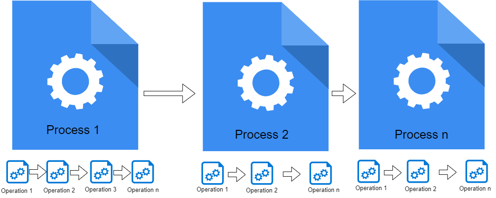
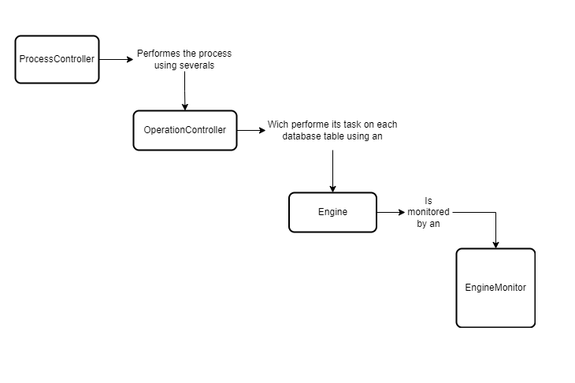
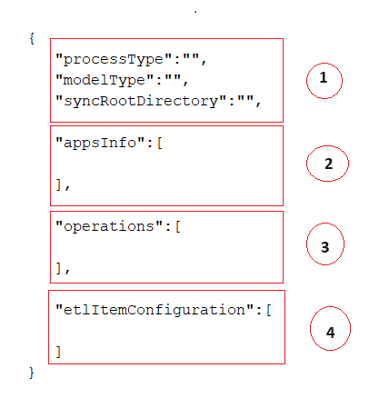

# Introduction
The epts-etl module is an OpenMRS module designed to perform generic ETL operations and much more. The epts-etl module can be integrated with an OpenMRS instance, but it can also run as a stand-alone Java application. Please note that this module is still in development, and some of its features may not function correctly at this time.
# Architecture overview
The epts-etl module is written in Java and follows the OpenMRS module pattern. Its core functionality is implemented at the API level, allowing it to operate as a stand-alone application. At the top of the EPTS-ETL logic are Processes, which represent a set of operations intended to function as tasks that collectively achieve a specific objective.

 

From the code perspective an process is handled by the [ProcessController](api/src/main/java/org/openmrs/module/epts/etl/controller/ProcessController.java) class and the tasks or operations are handled by [OperationController](api/src/main/java/org/openmrs/module/epts/etl/controller/OperationController.java) class. 
 
The process and its operations are configured via JSON file on which all the necessary information for a process to be run are specified. The configuration file will determine which kind of process must be performed.
 
The process configuration is mapped to [EtlConfiguration](api/src/main/java/org/openmrs/module/epts/etl/conf/EtlConfiguration.java) class and each operation are mapped to [EtlOperationConfig](api/src/main/java/org/openmrs/module/epts/etl/conf/EtlOperationConfig.java).
Each operation defined in the process configuration file will perform the very same task on all items listed on the configuration file. The etl item configuration is mapped to [EtlItemConfiguration](api/src/main/java/org/openmrs/module/epts/etl/conf/EtlItemConfiguration.java) which defines the rules of ETL.
 
An [Operation Controller](api/src/main/java/org/openmrs/module/epts/etl/controller/OperationController.java) performs its task using an [Task Processor](api/src/main/java/org/openmrs/module/epts/etl/engine/TaskProcessor.java). The processors are monitored by [Engine](api/src/main/java/org/openmrs/module/epts/etl/engine/Engine.java) class. The interaction between the core classes is illustrated on the image below.



## The Process Configuration File
The process configuration file is the heart of the application. For each process type there is a specific configuration setup which must be done. A configuration file is a JSON file which in almost all cases has 4 sections as shown below.

 
 
- **The section 1** contains the general configurations usually applied to all the operations and involved etl items.
- **The section 2** defines the database connection info for source database and/or destination database.
- **The section 3** defines the operations configuration parameters.
- **The section 4** lists the ETL configuration. This define the rules of how the extraction, transformation and load will be hundled.

## The common configuration/
- *processType*: A string representing the Process Type. The supported types are listed in the section "Supported Process Types."
- *etlRootDirectory*: a full path to the directory where the process files will be placed.
- *childConfigFilePath*: a full path to another JSON configuration file which defines a process that will be executed when the current process is finished. This parameter allows multiple processes to be executed in sequence. This can be useful, for example, when there is a need to merge multiple databases.
- *originAppLocationCode*: a token representing the location where the process is running. In the case of the merge process, this will be the source location.
- *manualStart*: an optional boolean indicating whether the process related to this configuration file will be manualy started. If true, the process will not start at application startup.
- *params*: a map object that enables the configuration of parameters. These parameters are usually used in queries defined in the ETL item configuration.
- *disabled*: indicates whether the process is disabled.
- *syncStageSchema*: an optional token indicating the database name where the process data will be stored. If not present, the name "etl_stage_area" will be used.
- *doNotTransformsPrimaryKeys*: indicates whether the primary keys in this process are transformed. If yes, the transformed records are given a new primary key; if no, the primary key in the source is the same in the destination.
- *manualMapPrimaryKeyOnField*: if present, the value from this field will be mapped as a primary key for all tables that don't have a primary key but have a field with a name matching this field. This value will be overridden by the corresponding value in the ETL configuration session if present there.
- *relationshipResolutionStrategy* defines how the ETL engine should handle relationship (foreign key) resolution for a field.
  By default, when a field represents a relationship, the ETL process attempts to resolve the corresponding parent record in the destination database.
  Supported values:
  - *RESOLVE* – Default behavior. The ETL engine looks up and resolves the corresponding record in the destination database.
  - *SKIP* – Skips relationship resolution. The transformed value is written directly to the destination field without lookup or validation.
  - *VALIDATE_ONLY* – Validates that the referenced record exists in the destination database without performing resolution. If the record does not exist, the ETL process reacts according to the configured error handling strategy- *autoIncrementHandlingType*: define how the schema defined auto-increment will be handled. The possible values: (1) AS_SCHEMA_DEFINED meaning that the Etl process will respect the Auto-Increment as defined on table Schema definition. This is the default behavior of the Etl Configuration (2) IGNORE_SCHEMA_DEFINITION meaning that the auto-increment defined by table schema will be ignored and the application itself will handle the key values. The value for this property can be overridden by the value from the same property from the Etl Item Configuration.
- *primaryKeyInitialIncrementValue*: A numeric value added to the primary key of the very first destination record for all tables defined in the ETL Item Configuration. This property cannot be used when autoIncrementHandlingType is explicitly set to AS_SCHEMA_DEFINED. If this property is provided and autoIncrementHandlingType is not specified, it will automatically be set to IGNORE_SCHEMA_DEFINITION. The value of this property will be applied to all destination tables defined in the *ETL Item Configuration*. However, you can override this value for specific tables by defining the same property within the *EtlItemConf* or *DstConf*. 
- *dynamicSrcConf*: This configuration parameter enables the dynamic setup of the EtlConfiguration. In this context, "dynamic" refers to the ability to derive certain parameters from a database table, allowing multiple configurations to be generated from a single configuration file. The configuration file effectively serves as a template, populated with data from table records. This approach is particularly useful when working with multiple database sources and performing specific processes on each of them. For example, you can register the database sources in a table (e.g., src_database) and use this table as a dynamic source for generating configurations.
- *finalizer*: represents a object which define the additional tasks to be performed after the process if finished.
- *startupScripts*:  A list of SQL scripts to be executed at startup. The files should be placed in @etlRootDirectory/dump-scripts/startup. It is important to ensure that multiple executions of these scripts do not result in inconsistencies;
- *reRunable*: Normally, when a process is completed, the application skips its execution if the user attempts to re-run it. This property allows the process to be executed multiple times. If the user initiates the process after it has finished, it will restart and execute from the beginning.
- *relatedEtlSrcTables*: Defines additional source tables that are not explicitly configured in the ETL process but are related to the primary configured source tables. These tables must be declared to ensure they are correctly recognized as part of the data domain rather than being treated as metadata tables. Properly listing all related source tables is essential for accurate relationship resolution during the ETL process, particularly when handling joins, foreign keys, or dependent records.
- *defaultInconsistencyBehavior*: Defines the default behavior to be applied when a data inconsistency is detected during the ETL process. A data inconsistency occurs when the ETL engine encounters unexpected or invalid data conditions, such as:
  - missing required references
  - invalid foreign key relationships
  - inconsistent source data values
  - unresolved dependencies between records
  This setting acts as a global fallback behavior and is applied whenever no specific behavior is defined at a lower level (e.g., field-level or transformer-level configurations).
  Supported values:
	- *MARK_RECORD_AS_FAILED* – The record is marked as failed, but the ETL process continues.
	- *SET_TO_NULL* –  Sets the relatedfield value to null..
	- *ABORT_PROCESS* – An exception is thrown and the ETL process is interrupted according to the configured execution strategy.
- *defaultExceptionBehavior*: Defines the default behavior to be applied when an exception occurs during the ETL process. An exception may occur during any phase of the ETL pipeline, including extraction, transformation, or
loading, and typically indicates an unexpected error such as: database access failures transformation errors (e.g. invalid expressions, parsing issues) missing required data internal processing errors
This configuration acts as a global fallback and is applied whenever no more specific behavior is defined at a lower level (e.g., field-level or transformer-level exception handling).

	Supported values:
  	- *LOG* – The exception is logged and the ETL process continues with the next record.
  	- *MARK_RECORD_AS_FAILED* – The record is marked as failed and processing continues.
  	- *ABORT_PROCESS* – The exception is propagated and the ETL process is interrupted.
       
## The Database configuration
This section allowd the database configuration. The "srcConnConf" allows the configuration of source database and the "dstConnConf" allows the configuration of destination database. Each element allow bellows parameters: 
- "dataBaseUserName" which represent the database username;
- "dataBaseUserPassword" which represents the database password;
- "connectionURI" the connection url to the dabase;
- "driveClassName" the jdbc drive class name for database connection;
- "schema" an optional field to specify the database schema if it cannot be determined from the connection url or if it is diffent from this one.
- "databaseSchemaPath": an optional field which indicate the path where the database schema is located. If present, and the specified database is not present on the specified database, the database will be created according to this script;
- Other configuration for database from jdbc.poll.Datasource: *maxActiveConnections*, *maxIdleConnections*, *minIdleConnections*

## dynamicSrcConf
This parameter enables the dynamic setup of the EtlConfiguration. In this context, "dynamic" refers to the ability to derive certain parameters from a database table, allowing multiple configurations to be generated from a single configuration file. The configuration file effectively serves as a template, populated with data from table records. This approach is particularly useful when working with multiple database sources and performing specific processes on each of them. For example, you can register the database sources in a table (e.g., src_database) and use this table as a dynamic source for generating configurations.

The very basic structure of definition of this parameter is shown bellow.

```
{
   ...
   "dynamicSrcConf":{
      "tableName":"",
      "extraConditionForExtract":"",
      "auxExtractTable":[
         
      ]
   }
   ...
}
```

- "tableName": is database table name which will act as the source of dynamic configuration
- "extraConditionForExtract": optional param which contains the extra sql condition to be injected when the operation queries for records to process.
- "auxExtractTable": optional list containing the joining tables which helps to add additional extraction conditions; this act as a extra data source also. For full details of "auxExtractTable" configuration please refere to [AuxExtractTable](#aux-extract-table)

## The finalizer
The finalizer is an object which perfome the finalization tasks. A finalizer is configured as a java class. Currently only a [SqlProcessFInalizer](api/src/main/java/org/openmrs/module/epts/etl/controller/SqlProcessFInalizer.java) is supported. And to use this, you only need to provide the "sqlFinalizerQuery". You can also provide a "connectionToUse" if needed which specify which connection to use to performe de query. The possible values are "mainConnInfo", "srcConnInfo" and "dstConnInfo". By default the "srcConnInfo" is used.

```
{
   ...
   "finalizer":{
      "finalizerFullClassName":"",
      "sqlFinalizerQuery":"",
      "connectionToUse":""
   }
   ...
}
```


## The Operation configuration
This section allow the configuration of operations. Each operation can be defined by the following fields:
- "operationType": indicates the operation to be executed for each item defined on ETL configuration session;
- "processingBatch": the amount of records to be processed in a batch, if not present, a default batch of 1000 will be applied;
- "threadingMode": indicates if the processing should be done using a SINGLE or MULTI threads. Possible values: MULTI, SINGLE, default is MULTI;
- "fisicalCpuMultiplier": when using MULTI threading, the amount of available physical CPU will be multiplied by the value from this propertie. This allow to overpower the processing. Notice that using big values for this can lead to process slowdown; 
- "processingMode": indicate the way the ETL items will be processed. (1) SERIAL: indicates that one ETL Item will be processed at time (2) PARALLEL: all the listed ETL Item will be processed at same time; if not present, a SERIAL mode will be applied;
- "processorFullClassName": a full class name indicating a customized processor.
- "skipFinalDataVerification": the final verification is done to check if all the records on the source were processed to the destination database. If this field is set to false, the final check will be skipped! Since the final verification could take time, disabling it could improve the speed; 
- "doNotWriteOperationHistory": by default the information of each processed record is stored on the Etl Staging table. This information is important as can help to know the source and destination of an record processed on the ETL process. If this field is set to true, the history will not be stored and this could improve the speed of process.
- "useSharedConnectionPerThread": If the processing is done by multiple threads, setting this field to true means all threads will share the same database connection. This can help reduce deadlocks but may negatively impact performance. This configuration is also useful when we need to ensure that the records in a batch are available in the target database simultaneously.
- "actionType": represent the action on the ETL process. The supported action are: (1) CREATE: This action creates new dstRecord on ETL operation (2) DELETE:  This action deletes the dstRecord on ETL operation (3) UPDATE: This action update the dstRecord on ETL operation. If not present, a CREATE action will be applied.
- "afterEtlActionType": defines the action which will be perfomed on the src record after the operation. Only the action "DELETE" will have effect;
- "dstType": indicates the destination type which can be: (1) **db**: the transformed record will be stored on the database (2) **json**: the transformed record will be written on json file (3) **dump**: the transformed record will be written os sql file as an sql query (4) **csv**: the transformed record will be written on csv file. When the dstType is a file, then the file will be stored under @etlRootDirectory/data/@originAppLocationCode (5) **console** the tranformed records will be written on the console
- "disabled": if true , the this operation will not be run;
- "child": a nested operation configuration which will be executed after the main operation is finished;
- "finishOnNoRemainRecordsToProcess": When a process starts, it determines the *minimum* and *maximum* records in intervals to be processed and calculates the *number of records to handle* within each interval. The process will analyze the entire range between the minimum and maximum records and will only complete once the maximum record is reached. However, if *finishOnNoRemainRecordsToProcess* is set to true, the process will finish as soon as the calculated number of records to process is reached, even if the maximum record has not been reached.
- "totalCountStrategy": Define the strategy for calculating the total number of records to be processed. When the application processes the ETL item for the first time, it calculates the total record count, which is useful for progress tracking. By default, this property is set to 'COUNT_ONCE,' meaning the application will calculate the total record count during the initial processing. If the process is interrupted and restarted, the count will not be recalculated. Depending on the complexity of the ETL process, this calculation can be time-consuming, and you may want to disable it. In such cases, you can use 'USE_MAX_RECORD_ID_AS_COUNT,' which uses the maximum record ID from the source table's record range as the total count. If you already have the count and you don't want the application recalculate it you can use the "USE_PROVIDED_COUNT" strategy; in this strategy you only need to provide the "totalAvaliableRecordsToProcess" within the The Etl operation Configuration as explained in the propertie below.
- "totalAvaliableRecordsToProcess": provide the pre-calculated total number of records do be processed. (refere to "totalCountStrategy" propertie above);       
	

## The etl item configuration
The etl item configuration section defines the rules of extraction, transformation and load. Each operation in a process will perform its task on these items. Below are listed the properties which can appear in an item configuration. Each item can contain two objects representing the data source configuration and destination configuration.

```
{
{
   "srcConf":{
      "tableName":"",
      "extraConditionForExtract":"",
      "observationDateFields":[
         
      ],
      "sharePkWith":"",
      "metadata":"",
      "removeForbidden":"",
      "uniqueKeys":[
         
      ],
      "parents":[
         
      ],
      "extraTableDataSource":[
         
      ],
      "extraQueryDataSource":[
         
      ],
      "onConflict":""
   },
   "dstConf":[
      
   ],
   "createDstTableIfNotExists":"",
   "autoIncrementHandlingType":"",
   "etlItemSrcConf":{
      
   },
   "disabled":"",
   "childItemConf":[
      
   ],
   "template":{
      "name":"template_name",
      "parameters":{
         "param1":"paramValue1",
         "param2":"paramValue2"
      }
   }
}
```

The srcConf defines the configuration of the data source for an ETL item, while the dstConf defines the destination tables and how data should be loaded into them. These configurations may be omitted in simple scenarios where no transformation is required, allowing destination fields to be automatically mapped from the source.

In addition, ETL items may optionally use a template, which allows configurations to be reused and parameterized, reducing duplication across similar ETL definitions. Templates can be applied at different levels of the configuration (e.g., srcConf, dstConf, childItemConf, etc.). Further details on how templates work and how to define them are provided below.

Below are the main configuration elements available for an ETL Item.

### The "srcConf"
The "srcConf '' allows the configuration of datasource in an etl process. The relevant configuration fields are explained below
- *tableName*: table name of the main data source.
- *parents*: list of configured parents. Note that if there is no additional configuration for the parent, there is no need to include this property as it will automatically loaded using the information schema;
- *metadata*: optional boolean indicating that the table is a metadata table;
- *removeForbidden*: optional boolean that indicate if records from this table can be automatically removed when there is inconsistencies
- *observationDateFields*: optional list of date fields which will be checked when an operation need to look for records which had some action in certain period (ex. records created or updated within a period)
- *extraConditionForExtract*: optional param which contains the extra sql condition to be injected when the operation queries for records to process.
- *uniqueKeys*: optional list containing the unique key info. This is unnecessary if the table has explicit unique keys;
- *auxExtractTable*: optional list containing the joining tables which helps to add additional extraction conditions; this act as a extra data source also;
- *extraTableDataSource*: optional list of auxiliary tables to be used as data source
- *extraQueryDataSource*: option list of auxiliary queries to be used as data source;
- *extraObjectDataSource*: option list of auxiliary objects configuration to be used as data source;
- *onConflict*: refere to [dstConf.onConflict](#onConflict) 
  
Bellow are additional explanation of complex configuration on "srcConf"

#### Unique Keys
The *"uniqueKeys"* allow the configuration of src table unique keys. If the table defines the unique keys in its metadata then there is no need to manually configure the unique keys. But when needed, the unique keys can be configured following below pattern.

``` {
   "srcConf":{
      "uniqueKeys":[
         {
            "fields":[
               {
                  "name":""
               }
            ]
         }
      ]
   }
}
```

#### Parents configuration
A parent is configured as an object and can have additional properties. Note that when there are no additional properties you can omit the parent on the list of parents. When you want to manually add parent on the etl item configuration it should have the appearance bellow:
```
{
   "srcConf":{
      "parents":[
         {
            "tableName":"",
            "mapping":[
               {
                  "childFieldName":"",
                  "parentFieldName":"",
                  "defaultValueDueInconsistency":"",
                  "setNullDueInconsistency":"",
                  "ignorable":""
               }
            ],
            "conditionalFields":[
               {
                  "name":"",
                  "value":""
               }
            ],
            "defaultValueDueInconsistency":"",
            "setNullDueInconsistency":""
         }
      ]
   }
}
```

For each parent, we can define the **mapping**, which allows us to specify the child and parent fields. Within the "mapping," we can also define the following fields: *defaultValueDueInconsistency*, *setNullDueInconsistency*, and *ignorable*.

If present, the value in the "defaultValueDueInconsistency" field will replace the original value in the child if the original value does not represent an existing parent. The "setNullDueInconsistency" field is a boolean value. If set to true, the original parent value will be replaced by null if it is inconsistent. The "ignorable" field indicates whether this relationship can be ignored.

Within the parent configuration we can also define the "conditionalFields". The conditional fields determine the condition when a specific relationship will be applied. This means that this relationship is not applied for all the records in the child table. An example can be found in openmrs data model. E.g the table person_attribute which has the fields "person_attribute_type_id" and "value". For the specific "person_attribute_type_id" the "value" could reference a specific record in other tables, ex: when the type is 7, then the "value" refies to a location which is detailed in table "location". In this case, we can map the relationship between the table "person_attribute" and "location" as a conditional relationship where the conditional field name is "person_attribute_type_id" and the conditional value is "7".

We can also define a global "defaultValueDueInconsistency" and "setNullDueInconsistency" in a relationship between the table and its parents. These are global properties within the relatishioship meaning that for all the mapping these values will be applied.   

#### The auxExtractTable table configuration
<a name="aux-extract-table"></a>

The **"auxExtractTable"** element, allow the specification of extra tables to be used as joining tables to the main table. This allow the inclusion of additional querying condition from those joining tables. This is also used as an additional data source for the etl item configuration.     

```
{
   "srcConf":{
      "auxExtractTable":[
         {
            "tableName":"",
            "joinExtraCondition":"",
            "joinExtraConditionScope":"",
            "joinFields":[
               {
                  "srcField":"",
                  "srcValue":"",
                  "dstField":"",
                  "dstValue":""
               }
            ],
            "joinType":"",
            "doNotUseAsDatasource":"",
            "auxExtractTable":[
               
            ]
         }
      ]
   }
}
```	 

As can be seen on the code above, each auxExtractTable can have the **tableName** which represents the name of table to be joined; **joinExtraCondition** which define an extra sql condition for joining; **joinFields** which are optional joining fields which must only be specified if the data model does not define the joining fields between the main table and the joining table or if you what to add static joining condition, there is also **joiningType** which can be INNER, LEFT or RIGHT; the **joinExtraConditionScope** tells weather the "joinExtraCondition" will be inserted on the JOIN clause or on the MAIN query clause; the possible values are: JOIN_CLAUSE or WHERE_CLAUSE; the "doNotUseAsDatasource" allows the exclusion of the "auxExtractTable" from the data sources; by default, an "auxExtractTable" is also a datasource.

**NOTE** that you can add inner "auxExtractTable" within the main "auxExtractTable" which is also a list of auxiliary tables which allow you to add more conditions for extraction.

###### The Joining Fields
<a name="joinFields"></a>

The **joinFields** property defines how the "auxExtractTable" joins with the main source table. This property can be omitted if the database schema already specifies the relationships between tables through foreign key references. However, you may need to manually define **joinFields** if:

- The schema does not define foreign key relationships.
- You want to include custom static joining conditions.

Each object in the joinFields is typically defined by a pair of fields: "srcField" and "dstField". Here:

- srcField refers to a field in the auxExtractTable.
- dstField refers to a field in the main source table.

If you need to include static conditions in the join, you can use the following pairs:

- "srcField" and "srcValue"
- "dstField" and "dstValue"

This allows for greater flexibility in customizing the join logic.


#### The extra datasource table configuration

The **"extraTableDataSource"** element allows the definition of additional tables that will be used as data sources alongside the main table defined in the ETL configuration. These tables are typically joined with the main table in order to enrich the extracted dataset with additional attributes or to apply extra filtering conditions during the extraction phase.

The relevant configuration for an extra table datasource is illustrated below.

```
{
   "srcConf":{
      "extraTableDataSource":[
         {
            "tableName":"",
            "joinExtraCondition":"",
            "joinExtraConditionScope":"", 
            "joinFields":[
               {
                  "srcField":"",
                  "srcValue":"",
                  "dstField":"",
                  "dstValue":""
               }
            ],
            "joinType":"",
            "auxExtractTable": [
	    ]
         }
      ]
   }
}
```

As shown in the configuration above, each **extraTableDataSource** may define the following properties:

- **tableName** specifies the name of the additional table that will be used as an auxiliary data source during extraction.

- **joinExtraCondition** defines an additional SQL condition that will be applied when joining this table with the main data source. This condition can be used to restrict or refine the joined records beyond the standard join criteria.

- **joinFields** defines optional join fields used to establish the relationship between the main table and the extra table. These fields should only be specified when the relationship between the tables cannot be automatically inferred from the data model or when a custom join condition is required. (See [The Joining Fields](#joinFields))

- **joinType** defines the type of SQL join used to link the extra table with the main table. The supported values are *INNER*, *LEFT*, or *RIGHT*. If this property is not specified, the default join type is *LEFT*. When the join type is set to *INNER*, the ETL process will skip the main record if no matching record is found in the extra table.

- **joinExtraConditionScope** specifies where the **joinExtraCondition** should be applied within the generated SQL statement. The condition can be placed either in the JOIN clause itself or in the main WHERE clause of the query. The supported values are *JOIN_CLAUSE* and *WHERE_CLAUSE*.

- **auxExtractTable** allows the definition of additional auxiliary tables that can be joined with the **extraTableDataSource**. These auxiliary tables are typically used to introduce extra filtering conditions or to provide additional data required for the extraction logic. They may also act as supplementary data sources. (See [AuxExtractTable](#aux-extract-table))

- 
#### The extraQueryDataSource configuration

The **"extraQueryDataSource"** element, allows the specification of extra queries to be used as data source in addition to the main table. There relevant configuration info for extra table datasource is shown below.    
```
{
   "srcConf":{
      "extraQueryDataSource":[
         {
            "name":"",
            "query":"", 
            "script":
            "required":""
         }
      ]
   }
}
```

As can be seen on the code above, each extraQueryDataSource can have the
- **name** which represents the name of extra datasource query;
- **query** which define the sql query;
- **script** which defines the relative path to the file containing the query. The application will look for the query files under @etlRootDirectory/dump-scripts/. Note that the application will try to load the "script" only if the "query" field is empty.
- **required** if true, the source record will be ignored if the query does not return an result;

#### The extraObjectDataSource configuration
An object datasource allows to include object fields as datasource. The values for those object fields can be directly configured within the object datasource or be generated using an user defined custom generator. This generator can be written on a supported programing language (notice that currently only java language is supported).

```
"extraObjectDataSource":[
   {
      "name":"",
      "objectFields":[
         {
            "name":"",
            "value":"",
			"defaultValue": ""
            "transformer":"",
            "dataType":"",
		    "overrideTriggerValue": ""	
         }
      ],
      "objectLanguage":"",
      "fieldsValuesGenerator":""
   }
]	 
```	
Each **extraObjectDataSource** defines an additional object-based data source whose values are dynamically generated during the ETL execution. This configuration allows the creation of synthetic objects that do not necessarily exist as records in the source database but are required to support the destination mapping.

Each **extraObjectDataSource** is defined by the following properties:

- **name**: a unique identifier for the datasource within the ETL item configuration. This name is used to reference the datasource in other configuration sections such as mappings or child destination configurations.
- **objectFields**: the list of fields that compose the generated object. Each field definition contains the following attributes:
  - (1) *name*: the unique name of the field within the datasource object.
  - (2) *value*: defines the value assigned to the field. The value may be a constant, a parameter, or an expression. Parameter values must start with the symbol '@' followed by an identifier. If no value is provided, the system assumes that the value will be generated by the configured fieldsValuesGenerator.
  - (3) *defaultValue*: specifies the default value to be used when the evaluated value results in null.
  <a name="field-transformers"></a>
  - (4) *transformer*: defines a transformation applied to the evaluated field value. Transformers allow complex processing such as expression evaluation, string manipulation, database lookups, or value mapping. The following transformer types are supported:
    - **ARITHMETIC_TRANSFORMER** Evaluates arithmetic expressions defined in the field value. The expression may contain numeric literals, arithmetic operators, and dynamic parameters referencing source fields. Before evaluation, any dynamic parameters are resolved and the resulting expression is evaluated using the exp4j expression engine.;
    - **STRING_TRANSFORMER**: Applies string manipulation operations using standard Java `String` methods, supporting chained method execution. The transformation expression must follow the format: (value).method1(arg1, arg2, ...).method2(...).methodN(...)

      Where:
      - **value** is the initial string to be transformed (can include dynamic placeholders)
      - **methodX** represents any valid method from the Java `String` class
      - **argX** are optional method arguments
        
		The transformer evaluates the expression from left to right, where the result of each method invocation becomes the input of the next method in the chain.

  		Before execution:
      		- Dynamic placeholders within the expression are resolved using available source data
      		- Method arguments are automatically converted to the expected parameter types of the target method
  		The evaluation is performed using Java reflectin, dynamically resolving and invoking the appropriate `String` methods at runtime.
  
		  **Examples:**

            - STRING_TRANSFORMER((John).toUpperCase())
		    - STRING_TRANSFORMER(hello world).substring(0,5).toUpperCase()
		    - STRING_TRANSFORMER(abc123).replace("123","XYZ").concat("-DONE")
		    - STRING_TRANSFORMER(@name).trim().toLowerCase()
        
        If the expression is invalid or a method cannot be resolved/invoked, an exception is raised.
    - **MAPPING_TRANSFORMER(mapping_table,mapping_src_field,mapping_dst_field,extra_condition:extra_condition_value,on_missing:on_missing_value)** performs value transformation using a lookup table stored in the database.
      The transformer searches for a record in the specified mapping table where the value of the source field matches the configured mapping_src_field. If a matching record is found, the value of mapping_dst_field is returned as the transformed value.

      Required parameters:
      - mapping_table – Name of the mapping table
      - mapping_src_field – Source field in the mapping table used for lookup
      - mapping_dst_field – Destination field in the mapping table whose value will be returned

      Optional parameters:
      - extra_condition:extra_condition_value – additional SQL condition used to filter the mapping table;
      - on_missing:on_missing_value – Defines the behavior when no mapping is found
        Supported values:
        - *MARK_RECORD_AS_FAILED* – The record is marked as failed and processing continues
        - *SET_TO_NULL* – The destination field is assigned null
        - *ABORT_PROCESS* – The ETL process is aborted with an exception

		“Optional parameters can be provided in any order using the key:value format. The transformer will automatically detect and apply only the parameters that are defined.”

    - **FAST_SQL_TRANSFORMER(sqlQuery)** Retrieves the field value by executing a SQL query against the source database. The SQL query must return at least one column; only the first column of the first row 
of the result set will be used as the destination field value. If the query returns no rows or the resulting value is null, the transformer will:
      - apply the destination field default value if defined, or
      - raise an ETL transformation exception otherwise.
    - **COALESCE_TRANSFORMER(fieldOrValue1, ..., fieldOrValuen)** Returns the first non-null value obtained from a sequence of candidate inputs. Each parameter is evaluated in order and transformed into a value; if the result of the first parameter is null, the transformer evaluates the second, and so on until a non-null value is found. If all evaluated parameters result in null, the final result is null.
Parameters may represent fixed values, dynamic parameters, or fields from available data sources. When referencing a field, it can be specified using the simple form "field" or the qualified form "dataSourceName.field" when disambiguation between data sources is required.
    - **SIMPLE_VALUE_TRANSFORMER** Performs direct assignment of the source value to the destination field. Any dynamic parameters present in the source value are resolved before assignment. This transformer is used automatically when no explicit transformer is defined for a field mapping.
    - **PARENT_ON_DEMAND_TRANSFORMER(parentTable,parent_field_oin_datasource_object:srcField,on_demand_check_condition:condition,template:templateName,dstField₁:srcFieldOrValue₁,...,dstFieldₙ:srcFieldOrValueₙ, override_fields:fiel1,field2,...)**: Ensures that a related parent record exists in the destination table and returns its primary key as the transformed value. The transformer may resolve the parent from the source database, reuse an already existing parent previously created on demand in the destination database, or create the parent on demand when necessary. The transformer requires the parent table name and at least one of the following special parameters:
      - *parent_field_oin_datasource_object:srcField* – identifies the source field used to resolve the parent record from the source database
      - *on_demand_check_condition:condition* – defines a condition used to search for an already existing parent record previously created on demand in the destination database  
      - *An optional template:templateName* parameter may also be provided to define the template used to initialize the EtlItemConfiguration responsible for creating or loading the parent on demand.
      - Additional parameters may be used to populate fields of the parent record when it needs to be created. Each additional parameter must follow the format **dstField:srcFieldOrValue**.
      - The value assigned to dstField may be:
        - a field from the available data sources (e.g. date_sta
      - *override_fields:fiel1,field2,...* - Defines the list of fields that should be updated on an existing parent record when it is reused by the PARENT_ON_DEMAND_TRANSFORMER. By default, when a parent record already exists in the destination database, it is reused as-is and no updates are applied. However, in some scenarios it may be necessary to update specific fields of the existing parent using the same transformation logic defined for parent creation.
        This parameter allows specifying which fields should be recalculated and overwritten on the existing parent record.
        Format
        ```
        override_fields:field1,field2,...,fieldN
        ```
        Behavior
        
        The specified fields will be recomputed using their corresponding mappings. The computed values will overwrite the existing values in the destination parent record. Only the listed fields are updated; all other fields remain unchanged. The same transformation rules apply as for parent creationrted:encounter_datetime)
        - a constant value (e.g. visit_type_id:42)
        - a dynamic ETL parameter starting with @ (e.g. location_id:@migration_location_id)
        - the literal null to explicitly set the field to null (e.g. date_stopped:null)
        - omitted after the colon to implicitly set the field to null (e.g. indication_concept_id:)
        
		```
		 **ParentOnDemandLoadTransformer**(
		    visit,
		    parent_field_oin_datasource_object:visit_id,
		    on_demand_check_condition:patient_id=patient_id and date_started=encounter_datetime,
		    template:visit_on_demand_template,
		    visit_type_id:42,
		    date_started:encounter_datetime,
		    location_id:@migration_location_id,
		    date_stopped:null,
		    indication_concept_id:
		)
		```

        - In this example, a record in the visit table will be created on demand if it does not yet exist. The date_started field will be populated from encounter_datetime, visit_type_id will receive the constant value 42, location_id will use the dynamic parameter @migration_location_id, and the fields date_stopped and indication_concept_id will be set to null.
- (5) *dataType*: an optional attribute used to explicitly define the data type of the field value. When not specified, the system will infer the type from the transformation result. Supported data types include: *int*, *long*, *double*, *string*, *date*, and *boolean*.
  - (6) *overrideTriggerValue*: specifies a value that triggers the override mechanism. If the transformed field value equals this value, the final value will be replaced by the configured defaultValue.
- **objectLanguage**: defines the scripting or expression language used to process field generation when custom logic is required. This property can be omitted if no custom field generator is used.
- **fieldsValuesGenerator**: specifies the fully qualified class name of a custom field value generator responsible for dynamically producing the values of the fields defined in objectFields.

For demo see [exploring-objectdatasource-field-transformers](docs/demo/README.md#exploring-objectdatasource-field-transformers) session.

#### The use of params whithin Src Configuration
The Src configuration allows the use of params for querying. The params can be present on "joinExtraCondition", "extraConditionForExtract", "query", "tableName", etc. Parameters will be defined as identifiers preceded by "@". Eng. "location_id = @locationId". The parameters can appear in several context within queries, namely, (1) as a select field: "SELECT @param1 as value FROM tab1 WHERE att2=1"; (2) in a comparison clause: "SELECT * FROM WHERE att2 = @param2" (3) In "in" clause: "SELECT * FROM tab1 WHERE att1 in (@param2)" (4) as DB resource: "SELECT * FROM @table_name WHERE att1 = value1". (5) in "tableName" specification in any party configuration file, e.g {"tableName":"@mainSchema.@nameOfTable"}

The parameter value will be lookuped following below sequence:
(1) first on configured parameters on "params" propertie;
(2) in not present will be lookuped on properties of etl configurations file;
(3) and finally on the current main src objects.  

For demo see [the-power-of-parameters](docs/demo/README.md#the-power-of-parameters) session.

### The "DstConf"
The "dstConf '' element is used to configure the destination object in an ETL operation. This element can be omitted if the dst fields can be automatically mapped from the available datasources;
If the "dstConf '' has more than one element or if the mapping cannot be automatically done, then it could be configured following the explanation below.

```
{
   "dstConf":[
      {
         "tableName":"",
         "prefferredDataSource":[
            
         ],
         "ignoreUnmappedFields":"",
		 "srcObjectCondition":""
         "dstType":"",
         "includeAllFieldsFromDataSource":"",
         "autoIncrementHandlingType":"",
         "primaryKeyInitialIncrementValue":"",
         "mapping":[
            {
               "dataSourceName":"",
               "srcField":"",
               "dstField":"",
               "defaultValue":"",
			   "mapToNullValue":"",
               "dataType": "",
               "overrideTriggerValue": "",
 			   "nullValueBehavior":"",
               "skipRelationshipResolution":"",
               "transformer": "",	
            }
         ],
         "joinFields":[
            {
               "srcField":"",
               "srcValue":"",
               "dstField":"",
               "dstValue":""
            }
         ],
         "onConflict":"",
         "winningRecordFieldsInfo":[
            
         ]
      }
   ]
}
```		

Bellow is the explanation for each field:
- **tableName** the destination table name;
- **prefferredDataSource** a comma separated list of tokens representing the data sources names from the "srcConf" in order of preference.  This is important when it comes to auto-mapping, if a certain dst field is present in multiple datasources. If there is only one datasource or if each field in the dst table appears only in one datasource, then this element could be omitted.
- **ignoreUnmappedFields** if there are fields on the dst that were not configured manually and could  not be resolved automatically then the application will fail. To avoid that, then set this field to true;
- **srcObjectCondition**: An optional condition used to select the appropriate source object(s) from the data source. If present, the src objects returned from the SrcConf will be filtered. Only the objects that satisfy this condition will be processed within the etl process.
-  **dstType** the destination type for this specific dstConf. If not present will be applied the "dstType" from operationConfiguration;
- **includeAllFieldsFromDataSource** If true, all the fields from all the data sources in "srcConf" will be included on the destination table (if it is automatically generated by the application); in contrast, only the mapped fields will be included on the destination table.
-  **mapping** is used to manually map the dataSource for specific fields in the dst table. The manual mapping is necessary if the dst field could not be automatically mapped because it does not appear in any dataSource in the srcConf. The relevant field for each mapping are:
   - (1) **dataSourceName** the datasource from were the data will be picked-up; this can be omitted if there is only one datasource containing the srcField or if the "prefferredDataSource" is defined. You can also specify the dataSourceName within the srcField like 'dataSourceName.srcFieldName'
   - (2) **srcField** the field on the dataSource from where the value will be picked up;
   - (3) **dstField** the field in dst which we want to fill;
   - (4) **defaultValue** default value to use when *value* is null;  
   - (5) **mapToNullValue** a boolean which indicates that this field should be filled with null value;
   - (6) **dataType** an optional token to specify the data type for value. By default, the type will match the final expression type from the transformer. Supported types: int, long, double, string, date, boolean      
   - (7) **overrideTriggerValue** the value that triggers the override mechanism. If the transformed field value equals to this value, the  transformed value will be replaced by the configured "defaultValue"
   - (8) **nullValueBehavior** Defines the behavior to be applied when the transformation of a field results in a null value. By default, null values are accepted and assigned to the destination field.
     However, this attribute allows overriding that behavior on a per-field basis.
	 Supported values:
     - *ALLOW* – The null value is accepted and assigned to the destination field. No action is taken.
     - *MARK_RECORD_AS_FAILED* – The record is marked as failed during the ETL process, but processing continues.
     - *ABORT_PROCESS* – An exception is thrown and the ETL process is interrupted according to the configured error handling strategy.
   - (9) **skipRelationshipResolution** defines whether the ETL engine should skip the resolution of relationships (foreign keys) for a given field.
     By default, when a field represents a relationship, the ETL process attempts to resolve the corresponding parent record in the destination database. This typically involves looking up the destination record based on the transformed value.
     When this attribute is set to *true* , the relationship resolution step is skipped, and the value is written directly to the destination field without performing any lookup or validation in the destination database.
     This can improve performance and is useful in scenarios where:
       - the value is already a valid destination identifier referential
       - integrity is guaranteed externally
       - relationship resolution is not required during the ETL process
         
     ⚠️ Warning:
         Disabling relationship resolution may result in invalid foreign key references if the value does not correspond to an existing record in the destination database.      
   - (10) **transformer**: defines a transformation applied to the evaluated field value. Transformers allow complex processing such as expression evaluation, string manipulation, database lookups, or value mapping. Refere to [field transformers](#field-transformers) for more details,
   -  **joinFields** allow the specification of the joining fields to the srcConf. Usually the joining fields can be automatically generated if the src and dst use the same unique keys. The joining fields are important when it comes to determining if all the src records were processed. If the joining fields are not present then the final verification of the process will be skipped for that specific table. (See [The Joining Fields](#joinFields)) 
- **autoIncrementHandlingType**: define how the schema defined auto-increment will be handled. The possible values: (1) AS_SCHEMA_DEFINED meaning that the Etl process will respect the Auto-Increment as defined on table Schema definition. This is the default behavior of the Etl Configuration (2) IGNORE_SCHEMA_DEFINITION meaning that the auto-increment defined by table schema will be ignored and the application itself will handle the key values.
- *primaryKeyInitialIncrementValue*: this override the same property defined on Etl Item Configuration.
<a name="onConflict"></a>
- **onConflict**: Defines how conflicts should be resolved during the ETL process (note: when not present, the correspondent configuration from "srcConf" will be used). A conflict occurs when an incoming record clashes with an existing one in the destination. The supported resolution strategies are:
  - `KEEP_EXISTING`: Retains the existing record unchanged, ignoring the incoming data.
  - `UPDATE_EXISTING`: Replaces the existing record with the incoming one.
-  **winningRecordFieldsInfo** optional list indicating the fields to be checked when there is conflict between an record with existing one on the etl process. When merge existing record, the incoming dstRecord will win if the listed fields have the specified values. Below is an example of winningRecordFieldsInfo.
  
```
{
   "dstConf":{
      "tableName":"location",
      "winningRecordFieldsInfo":[
         [
            {
               "name":"is_selected",
               "value":"1"
            },
            {
               "name":"voided",
               "value":"0"
            }
         ],
         [
            {
               "name":"fullProcessed",
               "value":"tue"
            }
         ]
      ]
   }
}
```	  

As can be seen the "winningRecordFieldsInfo'' is a list of lists, listing the fields which will be used to determine which record will win when there are conflicts between an incoming record and existing one. In the above example, if the incoming record has value 1 on field "is_selected" AND has value 0 on field "voided" OR  if the "fullProcessed" field has value true, then the incoming record will win.  Note that for the outer list the join condition will be "OR" and for the inner list the join condition will be "AND".

### The etlItemSrcConf
The etlItemSrcConf allows the dynamic configuration of Etl Items. This means that item elements can be dynamically gathered from one or more tables. Note that the etlItemSrcConf has the very same elements with SrcConf.     

### Other Properities for Etl Item Configuration
- *manualMapPrimaryKeyOnField*: if present, the value from this field will be mapped as a primary key for all tables that don't have a primary key but have a field with a name matching this field. This value will be overridden by the corresponding value in the SrcConf or DstConf if present there.
- *autoIncrementHandlingType*: define how the schema defined auto-increment will be handled. The possible values: (1) AS_SCHEMA_DEFINED meaning that the Etl process will respect the Auto-Increment as defined on table Schema definition. This is the default behavior of the Etl Configuration (2) IGNORE_SCHEMA_DEFINITION meaning that the auto-increment defined by table schema will be ignored and the application itself will handle the key values. The value for this property can be overridden by the value from the same property from the DstConf.
- *createDstTableIfNotExists*: if set to true, the dst table will be automaticaly created in the dst database if it does not exists.
- *disabled*: this propertie allows the item to bem ignored on the etl process.  
- *primaryKeyInitialIncrementValue*: this overrides the same property globaly defined on Etl Configuration;

### The "childItemConf"
The childItemConf represents a list of ETL configuration items used to process records that are related to the main records defined in the etlItemConf. These typically correspond to records stored in related tables and must often be processed within the same transaction as the main record.

For example, when migrating a person, it may also be necessary to migrate related records such as person_name and person_attribute. In this case, the person entity would be defined in the main etlItemConf, while the related entities (person_name, person_attribute) would be defined inside childItemConf.

This configuration element is defined as shown below:

```
{
   "childItemConf":[
      {
         "relatedParentDstConfName":"",
         "srcConf":{
            "tableName":""
         },
         "dstConf":[
            
         ],
         "childItemConf":[
            
         ]
      }
   ]
}
```
As shown above, a child configuration item has the same structure as the main etlItemConf. The main difference is the optional attribute *relatedParentDstConfName*.

This attribute specifies which dstConf from the parent etlItemConf the child item is associated with. It becomes mandatory when the parent etlItemConf defines more than one *dstConf*, so that the ETL engine can correctly determine the relationship between the parent and child configurations.

Additionally, since *childItemConf* itself supports nested childItemConf, it is possible to define multiple levels of related entities, allowing the ETL process to handle complex hierarchical data structures.

### The Template
Defines a reusable configuration template that can be applied to an ETL item or any of its nested elements. Templates allow the reuse of common configurations, reducing duplication and improving maintainability by parameterizing only the parts that vary (such as extraction conditions, table names, or filters).

A template is referenced using its name and an optional list of parameters:

```
   "template":{
      "name":"template_name",
      "parameters":{
         "param1":"paramValue1",
         "param2":"paramValue2"
      }
   }
```

Templates are defined externally in a JSON file with the following structure:
```
[
   {
      "name":"template_name",
      "parameters":[
         "param1",
         "param2"
      ],
      "template":{
         ...
      }
   }
]
```
By default, templates are loaded from a file named etl_elements_templates.json, which must be located in the same directory as the main ETL configuration file. If a different location is required, it can be specified using the global ETL configuration property:
```
etlTemplatesFilePath
```
This property should contain the full path to the templates file.

Templates can be used in any part of the EtlItemConfiguration, including but not limited to:

  - the root level of the item configuration
  - srcConf
  - dstConf
  - childItemConf
  - or any nested configuration element

When a template is applied, its configuration is merged into the target element, replacing or complementing the existing configuration based on the provided parameters.

This mechanism is especially useful for scenarios where multiple ETL items share similar configurations, differing only in specific parameters such as extraction conditions, field mappings, or filters.

## Default configuration files templates
In this section are listed some templates for configuration files for specific etl processes. For demo please check [this session](https://github.com/csaude/openmrs-module-epts-etl/blob/master/docs/demo/README.md#etl-quick-examples).

### The generic etl configuration template
This could be used for simple or complex etl processes. Using this template each src record will be transformed and saved to the destination database. The template for this process can be found [here](docs/process_templates/generic_etl.json)


### The database merge configuration template
The database merge is a process of joining together one or more databases. The template for this process can be found [here](docs/process_templates/db_merge.json)

### The database extract configuration template
The database extraction is a process of extracting a set of data from the src database to a dst database. The template for this process can be found [here](docs/process_templates/db_extract.json)

### The records update configuration template
The record update can be useful if you want to perform the update of records using data from a src database. The template for this process can be found [here](docs/process_templates/db_update.json)

### The records deletion configuration template
This process performs physical remotion of records on the target database. The template for this process can be found [here](docs/process_templates/db_delete.json) 


## Examples 
For demo examples please check [this session](docs/demo/README.md#etl-quick-examples).

# Running the application
To run this application you should (1) get the jar file either from the releases or (2) cloning and compiling the [eptssync project](https://github.com/FriendsInGlobalHealth/openmrs-module-eptssync.git).

If you go for the second option follow the steps bellow from your machine
```
git clone https://github.com/csaude/openmrs-module-epts-etl.git
cd openmrs-module-epts-etl
mvn clean install -DskipTests
```

Once you have the jar and have set up the configuration file (or configurations file) you can run the application hitting the below command.
```
java -Dlog.level=LOG_LEVEL -jar epts-etl-api-1.0.jar "path/to/configuration/file"
```
The LOG_LEVEL can be one of the following: DEBUG, INFO, WARN, ERR
