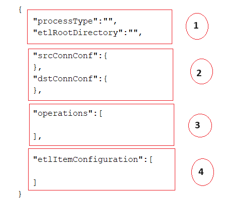

# Introduction
The epts-etl module is an OpenMRS module designed to perform generics ETL operations and mutch more. The epts-etl module can be integrated to an OpenMRS instance BUT can also run as a stand-alone java application. Take in mind that this module is still in development and some of its features may not well function now.
# Architecture overview
The EPTS-ETL module is written in Java and follows the OpenMRS modules pattern. Its core is implemented on the API level so it can run as a stand-alone application.
On the top of EPTS-ETL logic there is Processes which represents a set of operations which can be intended as tasks which together complete a certain objective.

 

From the code perspective an process is handled by the [ProcessController](api/src/main/java/org/openmrs/module/epts/etl/controller/ProcessController.java) class and the tasks or operations are handled by [OperationController](api/src/main/java/org/openmrs/module/epts/etl/controller/OperationController.java) class. 
 
The process and its operations are configured via JSON file on which all the necessary information for a process to be run are specified. The configuration file will determine which kind of process must be performed.
 
The process configuration is mapped to [EtlConfiguration](api/src/main/java/org/openmrs/module/epts/etl/conf/EtlConfiguration.java) class and each operation are mapped to [EtlOperationConfig](api/src/main/java/org/openmrs/module/epts/etl/conf/EtlOperationConfig.java).
Each operation defined in the process configuration file will perform the very same task on all items listed on the configuration file. The etl item configuration is mapped to [EtlItemConfiguration](api/src/main/java/org/openmrs/module/epts/etl/conf/EtlItemConfiguration.java) which defines the rules of ETL.
 
An [Operation Controller](api/src/main/java/org/openmrs/module/epts/etl/controller/OperationController.java) performs its task using an [Task Processor](api/src/main/java/org/openmrs/module/epts/etl/engine/TaskProcessor.java). The processors are monitored by [Engine](api/src/main/java/org/openmrs/module/epts/etl/engine/Engine.java) class. The interaction between the core classes is illustrated on the image below.


## The Process Configuration File
The process configuration file is the heart of the application. For each process type there is a specific configuration setup which must be done. A configuration file is a JSON file which in almost all cases has 4 sections as shown below.

 
 
- **The section 1** contains the general configurations usually applied to all the operations and involved etl items.
- **The section 2** defines the auxiliary application info. Usually an application info defines database connection info for example for source database and/or destination database.
- **The section 3** defines the operations configuration parameters.
- **The section 4** lists the ETL configuration. This define the rules of how the extraction, transformation and load will be hundled.

## The common configuration
Below are listed the parameters which can appear in the first section of the configuration file:
- *processType*: A string representing the Process Type. The supported type is listed on the section "Supported Types"
- *modelType*: the database model type. There are two types of models: "OPENMRS" and "OTHER". An OPENMRS model is the OpenMRS Data Model and any other model which is not OpenMRS is treated as "OTHER"
- *syncRootDirectory*: a full path to directory where the process stuff will be placed on
- *childConfigFilePath*: a full path to another JSON configuration file which defines a process which will be executed when the current is finished. This parameter enables the possibility to execute several processes in sequence. This can be useful for ex. if there is a need to perform a merge of multiple databases.
- *originAppLocationCode*: a token representing the location where the process is running for. In the case of the merge process this will be the source location.
- *automaticStart*: a boolean indicating that the process related to this configuration file will automatically start or not. 
- *params*: a map object which enable the configuration of parameters. This parameters are usually used on queries defined on the etl item contiguration.

## The AppsInfo configuration
As said before the appsInfo section contains the configurations of source and/or destination database. It is a list of objects each one representing an appInfo. Below are listed the common parameters which can be configured in each appInfo.
- *applicationCode*: the code of the application.
- *connInfo*: an object defining the database connection parameters. The fields of this object are: (1) "dataBaseUserName" which represent the database username, (2) "dataBaseUserPassword" which represents the database password (3) "connectionURI" the connection url to the dabase (4) "driveClassName" the jdbc drive class name for database connection (5) "schema" an optional field to specify the database schema if it cannot be determined from the connection url or if it is diffent from this one. 


## The etl item configuration
The etl item configuration section defines the rules of extration, transformation and load. Each operation in a process will perform its task on these item. Below are listed the properties which can appear in an item configuration. Each item can contains two objects representing the data source configuration and destination configuration.

```
{
   "srcConf":{
      "tableName":"",
      "extraConditionForExtract":"",
      "observationDateFields":[
         
      ],
      "sharePkWith":"",
      "metadata":"",
      "removeForbidden":"",
      "uniqueKeys":[
         
      ],
      "parents":[
         
      ],
      "extraTableDataSource":[
         
      ],
      "extraQueryDataSource":[
         
      ]
   },
   "dstConf":[
      
   ]
}
```

The dstConf define the configuration of the source of etl process for an item and the dstConf list the data destination table in the Etl process. This configuration can be omited if there is no transformation in the process and the destination table field can automatically mapped from the data source.

Bellow are explained the relevant configuration for "srcConf" and "dstConf".

### The "srcConf"
The "srcConf" allow the configuration of datasource in an etl process. The relevant configuration fields are explained bellow
- *tableName*: table name of the main data source.
- *parents*: list of configured parents. Note that if there is no additional configuration for the parent, there is no need to include this properitie as it will automatically loaded using the information schema;
- *metadata*: optional boolean indicating that the table is a metadata table;
- *removeForbidden*: optional boolean that indicate if records from this table can be automatically removed when there is inconsistencies
- *observationDateFields*: opetional list of date fields which will be checked when an operation need to look for records which had some action in certain period (ex. records created or updated within a period)
- *sharePkWith*: optional param indicating if the primary key of this table is shared with a parent. In this case that parent should be mentioned here.
- *extraConditionForExport*: optional param which contains the extra sql condition to be injected when the operation queries for records to process.
- *uniqueKeys*: optional list containing the unique key info. This is unnecessary if the table has explicit unique keys
- *extraTableDataSource*: optional list of auxiliary tables to be used as data source or auxiliary extraction condition
- *extraQueryDataSource*: option list of auxiliary queries to be used as databa source

Bellow are additional explanation of complex configuration on "srcConf"

#### Unique Keys
The *"uniqueKeys"* allow the configuration of src table unique keys. If the table define the unique keys in its metadata then there is no need to manual configure the unique keys. But when needed, the unique keys can be configured following bellow pathern.

``` {
   "srcConf":{
      "uniqueKeys":[
         {
            "fields":[
               {
                  "name":""
               }
            ]
         }
      ]
   }
}
```

#### Parents configuration
A parent if configured as an object and can have additional properties. Note that when there are no additional properties you can omit the parent on the list of parents. When you whant to manualy add parent on the etl item configuration it should have the apearence bellow:
```
{
   "srcConf":{
      "parents":[
         {
            "tableName":"",
            "mapping":[
               {
                  "childFieldName":"",
                  "parentFieldName":"",
                  "defaultValueDueInconsistency":"",
                  "setNullDueInconsistency":"",
                  "ignorable":""
               }
            ],
            "conditionalFields":[
               {
                  "name":"",
                  "value":""
               }
            ],
            "defaultValueDueInconsistency":"",
            "setNullDueInconsistency":""
         }
      ]
   }
}
```

#### The extra datasource table configuration

The **"extraTableDataSource"** element, allow the specification of extra tables to be used as data source in addition of the main table. There relevant configuration info for extra table dasource is shown bellow    

As can be seen on the code above, each parent can have the **tableName** with represents the name of parent table and the **ref** which has the information of references between the main table and its parents. Note that the ref is defined by the *"mapping"* list which allow the mapping of fields between the main table and its parent. Each mapping have optional attribute *"defaultValueDueInconsistency"* which allow to specify a default value when the main table is orphan of that parent. This is important in a merge or copy process. Another property is *"setNullDueInconsistency"* which is a boolean properity which indicate if the parent can be set to null if it is missing. The *"conditionalFields"*  helps to create conditional reference between the main table and its parent. The conditional parents are parents that have no database referential relationship. For ex. in openmrs model there is a relationship between *person_attribute* and *location*. This relationship exists when some conditions are observed (when the person_attribute.value=7)  

### DstConf

#### Winning Record Fields Info

In The *"winningRecordFieldsInfo"*

- *winningRecordFieldsInfo*: optional list indicating the fields to be checked when there are conflict between an record with existing one on the etl process


## Supported processes and its configuration files
In this section are listed all the avaliable process and the template of its configuration files.

###### QUICK_MERGE_WITH_ENTITY_GENERATION

This process performs a merge of a source database to a destination database in the same network. The process is called "quick" because no staging area and no data transport is done here. the operation for this process are:
- *DATABASE_PREPARATION*: prepare the sync stage area database;
- *POJO_GENERATION*: Generated the java POJO classes of the involved tables
- *DB_QUICK_MERGE_EXISTING_RECORDS*: performs the updates of existing records in destination database
- *DB_QUICK_MERGE_MISSING_RECORDS*: performs the merge of missing records in destination database

Note that since the POJO classes are dynamically generated (both for source and destination dbs) the source and destination model can be slightly different.  

The template for this process can be found [here](docs/process_templates/quick_merge_with_entity_generation.json)  


###### QUICK_MERGE_WITHOUT_ENTITY_GENERATION
This process is similar to QUICK_MERGE_WITH_ENTITY_GENERATION BUT here no POJO is generated since the process assumes that the two data models (source and destination) are uniform. But to use this process you need to first run the QUICK_MERGE_WITH_ENTITY_GENERATION so that the POJO will be generated and for the next merges you can use this process.

The template for this process can be found [here](docs/process_templates/quick_merge_whitout_entity_generation.json)

###### DB_INCONSISTENCY_CHECK
This process performs a referential inconsistency check on a specific database. One of the follow action will be taken to identified inconsistencies:
- The offending records will be moved from the database;
- The missing records will be replaced by the default parents.

All the affected records will be recorded in a staging area in a table called "inconsistence_info".
This process is performed by the follow operations:
- DATABASE_PREPARATION: prepare the sync stage area database;
- POJO_GENERATION: Generated the java POJO classes of the involved tables
- INCONSISTENCY_SOLVER: perform the inconsistency check and solver

The template for this process can be found [here](docs/process_templates/db_inconsistency_check.json)


###### DB_RE_SYNC
Performe the database re-sync from an openmrs database to dbsync application. This process is performed using the follow operations
- DATABASE_PREPARATION: prepare the sync stage area database;
- CHANGED_RECORDS_DETECTOR: performe a resync of updated records; 
- NEW_RECORDS_DETECTOR: performe a resync of new records. 

The template for this process can be found [here](docs/process_templates/db_re_sync.json)

###### DB_EXPORT
This process can be used to perform a remote sync between two databases using json files. The full sync process will need an [DATABASE_MERGE_FROM_JSON](#DATABASE_MERGE_FROM_JSON) to be run in the destination database.
The DB_EXPORT process is run in the source database and uses below operations:
- DATABASE_PREPARATION: prepare the sync stage area database;
- POJO_GENERATION: Generated the java POJO classes of the involved tables
- INCONSISTENCY_SOLVER: perform the inconsistency check and solver on the database
- EXPORT: export the database to json files
- TRANSPORT: transport the json files from source to the destination server. NOTE that by now the transport is using a simple copy command from one folder to another but in the future the transport could support injection of several transport mechanisms.

The template for this process can be found [here](docs/process_templates/db_export.json)

###### DATABASE_MERGE_FROM_JSON
This process completes the sync process started by a DB_EXPORT process. This process is supposed to run in a destination database.  
To perform its task this process uses below operations:
- DATABASE_PREPARATION: prepare the sync stage area database;
- POJO_GENERATION: Generated the java POJO classes of the involved tables
- LOAD: load json files to stage area
- DB_MERGE_FROM_JSON: perform the merge on destination using the stage area json data;
- CONSOLIDATION: perform the referential data consolidation 
- 
The template for this process can be found [here](docs/process_templates/database_merge_from_json.json)

# Running the application
To run this application you should (1) get the jar file either from the releases or (2) cloning and compiling the [eptssync project](https://github.com/FriendsInGlobalHealth/openmrs-module-eptssync.git).

If you go for the second option follow the steps bellow from your machine
```
git clone https://github.com/FriendsInGlobalHealth/openmrs-module-eptssync.git
cd openmrs-module-eptssync
mvn clean install -DskipTests
```

Once you have the jar and have set up the configuration file (or configurations file) you run the application hitting the below command.
```
java -Dlog.level=LOG_LEVEL -jar eptssync-api-1.0-SNAPSHOT.jar "path/to/configuration/file"
```
The LOG_LEVEL can be one of the following: DEBUG, INFO, WARN, ERR
