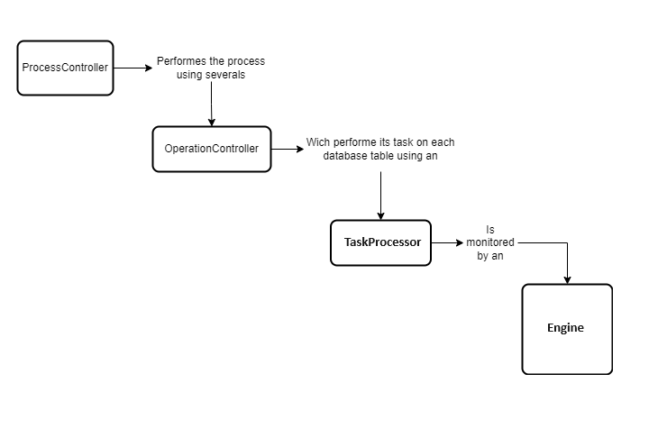

# Introduction
The epts-etl module is an OpenMRS module designed to perform generic ETL operations and much more. The epts-etl module can be integrated with an OpenMRS instance, but it can also run as a stand-alone Java application. Please note that this module is still in development, and some of its features may not function correctly at this time.
# Architecture overview
The epts-etl module is written in Java and follows the OpenMRS module pattern. Its core functionality is implemented at the API level, allowing it to operate as a stand-alone application. At the top of the EPTS-ETL logic are Processes, which represent a set of operations intended to function as tasks that collectively achieve a specific objective.

 

From the code perspective an process is handled by the [ProcessController](api/src/main/java/org/openmrs/module/epts/etl/controller/ProcessController.java) class and the tasks or operations are handled by [OperationController](api/src/main/java/org/openmrs/module/epts/etl/controller/OperationController.java) class. 
 
The process and its operations are configured via JSON file on which all the necessary information for a process to be run are specified. The configuration file will determine which kind of process must be performed.
 
The process configuration is mapped to [EtlConfiguration](api/src/main/java/org/openmrs/module/epts/etl/conf/EtlConfiguration.java) class and each operation are mapped to [EtlOperationConfig](api/src/main/java/org/openmrs/module/epts/etl/conf/EtlOperationConfig.java).
Each operation defined in the process configuration file will perform the very same task on all items listed on the configuration file. The etl item configuration is mapped to [EtlItemConfiguration](api/src/main/java/org/openmrs/module/epts/etl/conf/EtlItemConfiguration.java) which defines the rules of ETL.
 
An [Operation Controller](api/src/main/java/org/openmrs/module/epts/etl/controller/OperationController.java) performs its task using an [Task Processor](api/src/main/java/org/openmrs/module/epts/etl/engine/TaskProcessor.java). The processors are monitored by [Engine](api/src/main/java/org/openmrs/module/epts/etl/engine/Engine.java) class. The interaction between the core classes is illustrated on the image below.



## The Process Configuration File
The process configuration file is the heart of the application. For each process type there is a specific configuration setup which must be done. A configuration file is a JSON file which in almost all cases has 4 sections as shown below.

 
 
- **The section 1** contains the general configurations usually applied to all the operations and involved etl items.
- **The section 2** defines the database connection info for example for source database and/or destination database.
- **The section 3** defines the operations configuration parameters.
- **The section 4** lists the ETL configuration. This define the rules of how the extraction, transformation and load will be hundled.

## The common configuration
Below are listed the parameters which can appear in the first section of the configuration file:
- *processType*: A string representing the Process Type. The supported type is listed on the section "Supported Types"
- *etlRootDirectory*: a full path to directory where the process stuff will be placed on
- *childConfigFilePath*: a full path to another JSON configuration file which defines a process which will be executed when the current is finished. This parameter enables the possibility to execute several processes in sequence. This can be useful for ex. if there is a need to perform a merge of multiple databases.
- *originAppLocationCode*: a token representing the location where the process is running for. In the case of the merge process this will be the source location.
- *manualStart*: a boolean indicating that the process related to this configuration file will automatically start or not. If true, the process will not start at application startup 
- *params*: a map object which enable the configuration of parameters. This parameters are usually used on queries defined on the etl item contiguration.
- *disabled*: indicate whether the process is disabled or not;
- *syncStageSchema*: optional token indicating the database name where the process data will be stored. If not present will be used the name "etl_stage_area";
- *doNotTransformsPrimaryKeys*: Indicates if in this process the primary keys are transformed or not. If yes, the transformed records are given a new pk, if no, the pk is src is the same in dst;
- *manualMapPrimaryKeyOnField*: If present, the value from this field will be mapped as a primary key for all tables that don't have a primary key but have a field with name matching this field. This value will be overridden by the correspondent value on  ETL configuration session if present there.

## The Database configuration
This section is enables the database configuration. The "srcConnConf" allows the configuration of source database and the "dstConnConf" allows the configuration of destination database. Each element allow bellows parameters: 
- "dataBaseUserName" which represent the database username;
- "dataBaseUserPassword" which represents the database password;
- "connectionURI" the connection url to the dabase;
- "driveClassName" the jdbc drive class name for database connection;
- "schema" an optional field to specify the database schema if it cannot be determined from the connection url or if it is diffent from this one.
- "databaseSchemaPath": an optional field which indicate the path where the database schema is located. If present, and the specified database is not present on the specified database, the database will be created according to this script;
- Other configuration for database from jdbc.poll.Datasource: maxActiveConnections, maxIdleConnections, minIdleConnections

## The Operation configuration
This section allow the configuration of operations. Each operation can be defined by the following fields:
- "operationType": indicates the operation to be executed for each item defined on ETL configuration session;
- "processingBatch": the amount of records to be processed in a batch, if not present, a default batch of 1000 will be applied;
- "maxSupportedProcessors": an integer representing the quantity of max thread which will applied to execute the operation, if not present, the amount of avaliable server processors will be applied;
- "processingMode": indicate the way the ETL items will be processed. (1) SERIAL: indicates that one ETL Item will be processed at time (2) PARALLEL: all the listed ETL Item will be processed at same time; if not present, a SERIAL mode will be applied;
- "processorFullClassName": a full class name indicating a customized processor.
- "skipFinalDataVerification": the final verification is done to check if all the records on the source were processed to the destination database. If this field is set to false, the final check will be skipped! Since the final verification could take time, disabling it could improve the speed; 
- "doNotWriteOperationHistory": by default the information of each processed record is stored on the Etl Staging table. This information is important as can help to know the source and destination of an record processed on the ETL process. If this field is set to true, the history will not be stored and this could improve the speed of process.
- "useSharedConnectionPerThread": if the processing is done by multiple threads, then if this field is set to true, all the threads will share the same database connection. This can help when the process is facing many deadlocks, but can act badly on performance;
- "actionType": represent the action on the ETL process. The supported action are: (1) CREATE: This action creates new dstRecord on ETL operation (2) DELETE:  This action deletes the dstRecord on ETL operation (3) UPDATE: This action update the dstRecord on ETL operation. If not present, a CREATE action will be applied.
- "afterEtlActionType": defines the action which will be perfomed on the src record afte the operation. Only the action "DELETE" will have effect;
- "dstType": indicates the destination type which can be: (1) db: the transformed record will be stored on the database (2) json: the transformed record will be written on json file (3) dump: the transformed record will be written os sql file as an sql query (4) csv: the transformed record will be written on csv file. When the dstType is a file, then the file will be stored under @etlRootDirectory/data/@originAppLocationCode
- "disabled": if true , the this operation will not be run;
- "child": a nested operation configuration which will be executed after the main operation is finished.  
	

## The etl item configuration
The etl item configuration section defines the rules of extration, transformation and load. Each operation in a process will perform its task on these item. Below are listed the properties which can appear in an item configuration. Each item can contains two objects representing the data source configuration and destination configuration.

```
{
   "srcConf":{
      "tableName":"",
      "extraConditionForExtract":"",
      "manualMapPrimaryKeyOnField":"",
      "observationDateFields":[
         
      ],
      "metadata":"",
      "removeForbidden":"",
      "uniqueKeys":[
         
      ],
      "parents":[
         
      ],
      "extraTableDataSource":[
         
      ],
      "extraQueryDataSource":[
         
      ]
   },
   "dstConf":[
      
   ]
}
```

The srcConf define the configuration of the source of etl process for an item and the dstConf list the data destination table in the Etl process. This configuration can be omited if there is no transformation in the process and the destination table field can automatically mapped from the data source.

Bellow are explained the relevant configuration for "srcConf" and "dstConf".

### The "srcConf"
The "srcConf" allow the configuration of datasource in an etl process. The relevant configuration fields are explained bellow
- *tableName*: table name of the main data source.
- *parents*: list of configured parents. Note that if there is no additional configuration for the parent, there is no need to include this properitie as it will automatically loaded using the information schema;
- *metadata*: optional boolean indicating that the table is a metadata table;
- *removeForbidden*: optional boolean that indicate if records from this table can be automatically removed when there is inconsistencies
- *observationDateFields*: opetional list of date fields which will be checked when an operation need to look for records which had some action in certain period (ex. records created or updated within a period)
- *extraConditionForExport*: optional param which contains the extra sql condition to be injected when the operation queries for records to process.
- *uniqueKeys*: optional list containing the unique key info. This is unnecessary if the table has explicit unique keys;
- *selfJoinTables*: optional list containing the joining tables which helps to add additional extraction conditions; 
- *extraTableDataSource*: optional list of auxiliary tables to be used as data source or auxiliary extraction condition
- *extraQueryDataSource*: option list of auxiliary queries to be used as databa source;

Bellow are additional explanation of complex configuration on "srcConf"

#### Unique Keys
The *"uniqueKeys"* allow the configuration of src table unique keys. If the table define the unique keys in its metadata then there is no need to manual configure the unique keys. But when needed, the unique keys can be configured following bellow pathern.

``` {
   "srcConf":{
      "uniqueKeys":[
         {
            "fields":[
               {
                  "name":""
               }
            ]
         }
      ]
   }
}
```

#### Parents configuration
A parent if configured as an object and can have additional properties. Note that when there are no additional properties you can omit the parent on the list of parents. When you whant to manualy add parent on the etl item configuration it should have the apearence bellow:
```
{
   "srcConf":{
      "parents":[
         {
            "tableName":"",
            "mapping":[
               {
                  "childFieldName":"",
                  "parentFieldName":"",
                  "defaultValueDueInconsistency":"",
                  "setNullDueInconsistency":"",
                  "ignorable":""
               }
            ],
            "conditionalFields":[
               {
                  "name":"",
                  "value":""
               }
            ],
            "defaultValueDueInconsistency":"",
            "setNullDueInconsistency":""
         }
      ]
   }
}
```

#### The selfJoinTables table configuration

The **"selfJoinTables"** element, allow the specification of extra tables to be used as joining tables to the main table. This allow the inclusion of additional querying condition from those joining tables     

```
{
   "srcConf":{
      "selfJoinTables":[
         {
            "tableName":"",
            "joinExtraCondition":"", 
            "joinFields":[
               {
                  "srcField":"",
                  "dstField":""
               }
            ],
            "joinType":""
         }
      ]
   }
}
```	 

As can be seen on the code above, each selfJoiningTable can have the **tableName** with represents the name of table to be joined; **joinExtraCondition** which define an extra sql condition for joining; **joinFields** which are optional joining fields which must only be spefied if the data model does not define the joining fields between the main table and the joining table, Final there is **joiningType** which can be INNER, LEFT or RIGHT.  


#### The extra datasource table configuration

The **"extraTableDataSource"** element, allow the specification of extra tables to be used as data source in addition of the main table. There relevant configuration info for extra table dasource is shown bellow    

```
{
   "srcConf":{
      "extraTableDataSource":[
         {
            "tableName":"",
            "joinExtraCondition":"", 
            "joinFields":[
               {
                  "srcField":"",
                  "dstField":""
               }
            ],
            "joinType":"",
            "selfJoinTables": [
	    ]
         }
      ]
   }
}
```

As can be seen on the code above, each extraTableDataSource can have the **tableName** with represents the name of extra datasource table; **joinExtraCondition** which define an extra sql condition for joining; **joinFields** which are optional joining fields which must only be spefied if the data model does not define the joining fields between the main table and the joining table, Final there is **joiningType** which can be INNER, LEFT or RIGHT. The **selfJoinTables** allow the inclusion of addictional tables which can be joined whith the extraTableDataSource for propose of inclusion of extra condition. 

#### The extraQueryDataSource configuration

The **"extraQueryDataSource"** element, allow the specification of extra queries to be used as data source in addition of the main table. There relevant configuration info for extra table dasource is shown bellow.    

```
{
   "srcConf":{
      "extraQueryDataSource":[
         {
            "name":"",
            "query":"", 
            "script":
            "required":""
         }
      ]
   }
}
```

As can be seen on the code above, each extraQueryDataSource can have the 
- **name** wich represents the name of extra datasource query;
- **query** which define the sql query;
- **script** which defines the relative path to the file containing the query. The application will look for the query files should under $etlRootDirectory/dump-scripts/. Note that the application will try to load the "script" only if the "query" field is empty.
- **required** if true, the source record will be ignored if the query does not return an result; 

#### The use of params whithin Src Configuration
The Src configuration allows the use of params for quering. The params can be presents on "joinExtraCondition", "extraConditionForExtract", "query", etc. Parameters will be defined as idenfiers preceded by "@". Eng. "location_id = @locationId". The parameters can apper in serveral context whithin queries, namely, (1) as a select field: "SELECT @param1 as value FROM tab1 WHERE att2=1"; (2) in a comparison clause: "SELECT * FROM WHERE att2 = @param2" (3) In "in" clause: "SELECT * FROM tab1 WHERE att1 in (@param2)" (4) as DB resource: "SELECT * FROM @table_name WHERE att1 = value1".

The parameter value will be lookuped on:
(1) global configurations parameters if the parameters appers on the main src table configuration
(2) current main src object if the parameter apper on "extraQueryDataSource", or "extraTableDataSource", but then on the global properties if it is not present on the main src object.  


### The DstConf
The "dstConf" element is used to configure the destination object in an ETL operation as well the transformation rules. This element can be ommited there is no transformation needed from the src to destination (eg. if its name and fields areexactly the same with the "srcConf").
If the "dstConf" has more than one elements or if there is needed a tranformation of src record to dst record, then it could be configured following bellow explanation.

```
{
   "dstConf":[
      {
         "tableName":"",
         "prefferredDataSource":[],
         "ignoreUnmappedFields":"",
         "dstType":"",
         "transformer":"",
         "mapping":[
            {
               "dataSourceName":"",
               "srcField":"",
               "dstField":"",
               "srcValue":"",
               "mapToNullValue":"",
               "transformer":""
            }
         ],
         "joinFields":[
            {
               "srcField":"",
               "dstField":""
            }
         ],
         "winningRecordFieldsInfo":[
            
         ]
      }
   ]
}
```		

Bellow is the explanation for each field:
- **tableName** the destination table name;
- **prefferredDataSource** a comma separated list of tokens representing the datasources names from the "srcConf" in order of preference.  This is important when it cames to auto-mapping, if a certain field is present in multiple datasources. If there is only one datasource or if each field in dst table appears only in one datasource, then this element could be ommited.
- **ignoreUnmappedFields** if there are fields on the dst that were not configured manually and could  not be resolved automatically then the application will fail. To avoid that, then set this field to true;
-  **dstType** the destination type for this specific dstConf. If not present will be applied the "dstType" from operationConfiguration;
-  **transformer** a transformer is a java class which implements a custom transformation of src to dst. The transformers must implement the [EtlRecordTransformer](api/src/main/java/org/openmrs/module/epts/etl/etl/processor/transformer/EtlRecordTransformer.java) interface. If there is a custom transformer you must place here the full class of the transformer.
-  **mapping** is used to manualy map the dataSource for specific fields in dst table. The manual mapping is necessary if the dst field could not automatically mapped because it does not apper in any dataSource in the srcConf. The relevant field for each mapping are: (1) *dataSourceName* the datasource from were the data will be picked-up; this can be ommited if the value for this fields is from a constant, parameter or from a transformer (2) *srcField* the field on the dataSource from were the value will be pickedup; this can be ommited if there is no datasource for this dst field (3) *dstField* the field in dst which we want to fill (4) *srcValue* allow to fill the dst field with a constant value or a parameter; a parameter could be specified by using '@' at beggining of identifier. e.g "@siteId" (5) *mapToNullValue* a boolean which indicates that this field should be filled with null value (6) a transformer is a java class which implements a custom transformation of field from src field to dst field. The field transformers must implement the [EtlFieldTransformer](api/src/main/java/org/openmrs/module/epts/etl/etl/processor/transformer/EtlFieldTransformer.java) interface. If there is a custom field transformer you must place here the full class of the transformer.
-  **joinFields** allow the specification of the joining fields to the srcConf. Usually the joining fields can be automatically generated if the src and dst usa the same unique keys. The joining fields are important when it cames to determine if all the src records were processed. If the joining fields are not present then the final verification of process will be skipped for that specifi table.
-  **winningRecordFieldsInfo** optional list indicating the fields to be checked when there are conflict between an record with existing one on the etl process. When merge existing record, the incoming dstRecord will win if the listed fields have the specified values. Bellow is an example of winningRecordFieldsInfo.
```
{
   "dstConf":{
      "tableName":"location",
      "winningRecordFieldsInfo":[
         [
            {
               "name":"is_selected",
               "value":"1"
            },
            {
               "name":"voided",
               "value":"0"
            }
         ],
         [
            {
               "name":"fullProcessed",
               "value":"tue"
            }
         ]
      ]
   }
}
```	  

As can be seen the "winningRecordFieldsInfo" is a list of lists, listing the fields which will be used to determine which record will win when there are conflicts betwee an incoming record and existing one. In above example, if the incoming record has value 1 on field "is_selected" AND has value 0 on field "voided" OR  if the "fullProcessed" field has value true, then the incoming record will win.  Note that for the outer list the join condition will be "OR" and for the inner list the join condition will be "AND".

## Default configuration files templates
In this section are listed some templates for configuration files for specific etl processes.

###### The generic etl configuration template
This could be used for simple or complex etl process. Using this template each src record will be transformed and saved to the destination database. The template for this process can be found [here](docs/process_templates/generic_etl.json)
For demo please check this session.


###### The database merge configuration template
The database merge is a process of joining together one or more databases. The template for this process can be found [here](docs/process_templates/db_merge.json) 

###### The database extract configuration template
The database extraction is a process of extracting a set of data from the src database to a dst database. The template for this process can be found [here](docs/process_templates/db_extract.json) 

###### The records update configuration template
The record update can be useful if you what to performe the update of records using data from a src database. The template for this process can be found [here](docs/process_templates/db_update.json) 

###### The records deletion configuration template
This process performe fisical remotion of records on target database. The template for this process can be found [here](docs/process_templates/db_delete.json) 

## Examples 
In this session are presented some examples to performe differents kinds of etl process. 

# Running the application
To run this application you should (1) get the jar file either from the releases or (2) cloning and compiling the [eptssync project](https://github.com/FriendsInGlobalHealth/openmrs-module-eptssync.git).

If you go for the second option follow the steps bellow from your machine
```
git clone https://github.com/csaude/openmrs-module-epts-etl.git
cd openmrs-module-epts-etl
mvn clean install -DskipTests
```

Once you have the jar and have set up the configuration file (or configurations file) you run the application hitting the below command.
```
java -Dlog.level=LOG_LEVEL -jar epts-etl-api-1.0.jar "path/to/configuration/file"
```
The LOG_LEVEL can be one of the following: DEBUG, INFO, WARN, ERR
