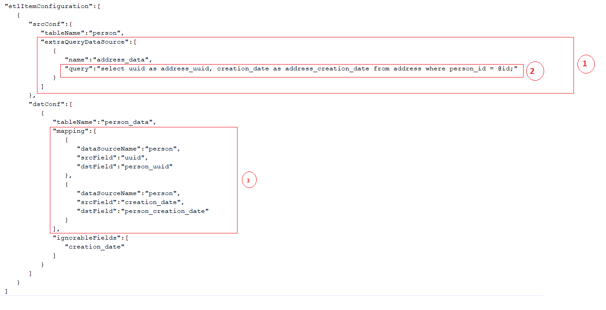

## Etl quick examples

NOTE that All the demo examples use mysql as dbms, but you can change the db configuration to run with any of the following databases: postgres, oracle, sqlserver.

#### Simple etl process.
This example shows the basic ETL process where the records from one database are copied to the destination database. This is a very basic process because there is no transformation between the processes. The src and dst structure is the very same between the two databases.
To run this demo follow the instructions below:
- (1) Download the content of [this directory](quick-demo).
- (2) Edit the [conf.json](quick-demo/conf.json) file placing the correct values for the following attributes: "etlRootDirectory", "dataBaseUserName" and "dataBaseUserPassword".
- (3) Run the [sql script](quick-demo/db_schema_and_data.sql) to create the databases. This script creates a src database filled with data and an empty dst database.
- (4) [Run the application using the conf.json as configuration file](https://github.com/csaude/openmrs-module-epts-etl/tree/master?tab=readme-ov-file#running-the-application)

#### Etl with transformation
This example demonstrates how to perform a transformation on the ETL process. The transformation is needed when there are differences between the source table and destination table or if there are multiple data sources to one destination. We want to bring together data from two tables. The process is based on [this configuration file](etl-with-transformation/conf.json).
Let's take a look at the configuration file. We will be focused on "etlItemConfiguration". In below image we represent in the left the data model of source and destination database.

 

- (1) In this configuration we defined the **person** table as the main source table. Because we also want data from the **address** table, we added it to the list of "extraTableDataSource". Note the use of "INNER" on joinType. This means that only "person" with "address" will be picked up.
- (2) In the dstConf we highlighted the "mapping". Here we map only the fields on the destination table which cannot be automatically mapped, namely: "person_uuid", "person_creation_date", "address_uuid" and "address_creation_date". There is no need to map the other fields since they can be automatically mapped.
- (3) note that for each mapping there is "dataSourceName", "srcField", "dstField". Note that we have two data sources, "person" and "address" and we map their fields accordling.
- (4) note that we added the field "creation_date" on the "ignorableFields" because we do want to include it on the transformation as it has default value on destination table which is CURRENT_TIMESTAMP.

  To run this demo example follow the instrunctions below:
 - (1) Download the content of [this directory](etl-with-transformation).
- (2) Edit the [conf.json](etl-with-transformation/conf.json) file placing the correct values for the following attributes: "etlRootDirectory", "dataBaseUserName" and "dataBaseUserPassword".
- (3) Run the [sql script](etl-with-transformation/db_schema_and_data.sql) to create the databases. This script creates a src database filled with data and an empty dst database.
- (4) [Run the application using the conf.json as configuration file](https://github.com/csaude/openmrs-module-epts-etl/tree/master?tab=readme-ov-file#running-the-application) 

#### Etl with transformation (Using query datasource)
This example demonstrates how to perform a transformation on the ETL process using a sql query as additional data source. This example is similar to the previous one since the data models are the same, but in this case we will be using "extraQueryDataSource" instead of "extraTableDataSource". Note that sometimes we can use both in some cases. The process is based on [this configuration file](etl-with-query-data-source/conf.json).
Let's take a look at the configuration file. We will be focused on "etlItemConfiguration".

 

- (1) In this configuration we defined the **person** table as the main source table. Because we need additional data from another table, we added an "extraQueryDataSource" to allow the querying of address data. Note that in some cases we may need to use multiple queries and in that case we can add as many "extraQueryDataSource" as we need. 
- (2) The query we are using here is a very simple one, as it only query from one table. Note that we are using a parameter called "id" for person_id; this parameter will be picked up from the main src object, in this case the person table.
- (3) In the dstConf we highlighted the "mapping". Here we map only the fields on the destination table which cannot be automatically mapped, namely: "person_uuid", "person_creation_date". There is no need to map the other fields since they can be automatically mapped.

To run this demo example follow the instructions below:
- (1) Download the content of [this directory](etl-with-query-data-source).
- (2) Edit the [conf.json](etl-with-query-data-source/conf.json) file placing the correct values for the following attributes: "etlRootDirectory", "dataBaseUserName" and "dataBaseUserPassword".
- (3) Run the [sql script](etl-with-query-data-source/db_schema_and_data.sql) to create the databases. This script creates a src database filled with data and an empty dst database.
- (4) [Run the application using the conf.json as configuration file](https://github.com/csaude/openmrs-module-epts-etl/tree/master?tab=readme-ov-file#running-the-application) 

#### Using complex extraction queries
Sometime there is a need to use complex queries to define extraction rules. The below example illustrates the ETL configuration were additional rules for extraction. It is based on [this configuration file](extraction-rules/conf.json). Let's take a look at the database model and the complex extraction configuration. Take a look at the img below.

 

Here the extra extraction rules are defined by two elements: the "selfJoinTables" and "extraConditionForExtract"
 
- (1) the "selfJoinTables" is a list of tables which helps to add conditions from other tables related to the main table. In this example, the main table is "person" and we want to add an extra extract condition from the table "office". So we listed it as a "selfJoinTable". Note that from the data model there is "joinFields" between the two tables as the "person" table has foreign reference to the "office" table. In case were there is no relationship defined from the data model the "joinFields" could be specified manually (see [selfJoinTables configuration](https://github.com/csaude/openmrs-module-epts-etl/tree/master?tab=readme-ov-file#the-selfjointables-table-configuration)).
- (2) within the selfJoinTable we can include additional joining conditions using the attribute "joinExtraCondition". In our example we want to extract only people which are allocated to an annexed office;
- (3) we can also add extra extract condition which does not use self joining tables; the attribute "extraConditionForExtract" allow a generic way to include extra condition for extraction in an ETL process. In our example we want to extract only people which are not present in the destination table which is etl_demo_with_extraction_rules_dst_db.person_data.  

